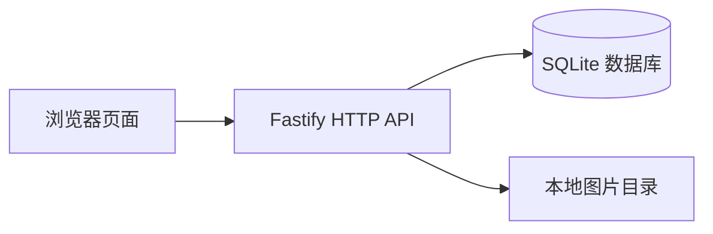

<div align="center">


<h1>校园失物招领</h1>

<p>让每一件失物都能回家。</p>

<p>集中发布校园寻物与招领信息，通过搜索、筛选和收藏查找线索，联系发布者并管理找回进度。</p>

<p>
  
  
  
  
</p>

<p>
  <a href="#界面预览">界面预览</a> ·
  <a href="#功能特性">功能特性</a> ·
  <a href="#快速开始">快速开始</a> ·
  <a href="docs/local-backend.md">接口与运行文档</a>
</p>

</div>

## 项目介绍

校园失物招领是一套适配手机和桌面浏览器的 Web 应用，为失主、拾得者及提供线索的同学提供统一的信息入口。用户可以发布寻物或招领信息，按物品名称、区域、分类和事件日期查找记录，通过详情中的联系方式沟通，并在找回或归还后更新状态。

项目采用原生 HTML、CSS、JavaScript 前端与独立后端接口。完整本地模式支持账号登录、图片上传和数据库持久化，同时保留无需安装依赖即可打开的静态体验入口。

## 界面预览

<p align="center">
  
</p>

<p align="center">首页 · 发布信息 · 个人中心</p>

## 功能特性

| 功能 | 说明 |
| --- | --- |
| 寻物与招领 | 共用发布表单，按类型切换丢失／拾取提示，支持图片和物品描述 |
| 搜索与筛选 | 名称搜索、最近搜索、地点和分类多选、事件日期范围、发布时间排序 |
| 信息管理 | 编辑本人发布、标记完成、取消完成和删除，重要操作提供确认 |
| 收藏 | 卡片和详情一键收藏，支持首页收藏筛选和个人收藏列表 |
| 紧急公告 | 滑动浏览急寻信息，展示图片、事件时间、地点及酬谢，可进入对应详情 |
| 用户与个人主页 | 注册登录、昵称头像修改、校区选择、公开发布列表和状态统计 |
| 账号安全 | 密码修改、恢复码找回、会话管理及服务端操作权限校验 |
| 内容管理 | 管理员维护公告、设置有效期、撤下公告及删除内容 |

### 三项主要设计

- **收藏与操作反馈**：保存可能相关的信息，便于后续核对。粉色爱心、卡片边框与收藏数量同步变化，取消收藏后更新列表。
- **紧急公告栏**：首页优先展示物品名称、丢失时间、地点和酬谢，支持滑动、箭头及圆点切换。“联系我们发布紧急”展示运营团队示例微信 `campus_demo`。
- **类型与状态配色**：暖棕色表示寻物，浅绿色表示招领，灰蓝色表示已完成；配合文字标签区分状态，收藏提示可同时保留。

寻物支持多个可能丢失区域，并标注“模糊范围”；招领记录单一拾取区域。列表展示丢失／拾取时间，详情与本人发布另列发布时间和修改时间。

## 快速开始

### 完整本地应用

环境要求：**Node.js 24.x，版本不低于 24.19.0**；推荐使用 Chrome 浏览器。

```powershell
git clone https://github.com/MieSheeeep/102402136-102402152.git
cd 102402136-102402152
npm.cmd ci
npm.cmd start
```

打开 [http://127.0.0.1:3000](http://127.0.0.1:3000)，可自行注册账号，或使用以下演示账号：

| 账号 | 密码 | 初始内容 |
| --- | --- | --- |
| `demo_student` | `CampusDemo123!` | 叶同学：三条发布，含一条已完成；两条收藏 |
| `demo_lin` | `CampusDemo123!` | 林同学：雨伞寻物；一条收藏 |

首次启动会保存七条发布、三条急寻公告和五位发布者。修改和删除会持久保存，重启不会还原演示数据。若账号名称已有占用，程序生成带后缀的新演示账号，启动终端显示实际名称。演示用户提供初始头像、简介、校区和示意联系方式，均可在设置中修改。

注册时请保存账号恢复码，忘记密码时使用该码重设。发布者身份由登录会话确定，普通账号不代表学校身份认证。

> macOS / Linux 可将上述 `npm.cmd` 替换为 `npm`。Chrome 页面测试需要本机已安装 Chrome。

### 静态体验

下载完整项目并保留目录结构，用 Chrome 直接打开根目录的 `index.html`。无需安装 Node.js 或启动后端，可体验发布、搜索、筛选、详情、收藏、编辑和状态管理。

| 运行方式 | 数据保存 | 适用范围 |
| --- | --- | --- |
| `npm.cmd start` | SQLite 数据库与本地图片目录 | 真实账号、多用户权限、图片上传和完整业务流程 |
| 直接打开 `index.html` | 当前浏览器的 `localStorage` | 固定本地用户的核心交互体验，不含账号系统及图片上传 |

两种方式的数据独立保存，不自动互通。HTTP 模式请使用项目提供的启动命令，其他静态 HTTP 服务不提供业务接口。

## 典型使用流程

1. 注册或登录，发布寻物／招领信息，填写名称、事件时间、地点和联系方式，图片与描述可选。
2. 在首页搜索和筛选，打开详情核对信息；需要再次查看时加入收藏。
3. 通过详情中的联系方式在应用外沟通。复制受浏览器限制时，可选择文本手动复制。
4. 确认找回或归还后，发布者在“我的发布”中标记完成。误操作可确认取消，原内容和发布时间保留。

## 技术结构



| 层次 | 技术与职责 |
| --- | --- |
| 前端 | HTML、CSS、JavaScript；页面渲染、导航、表单及交互反馈 |
| 业务规则 | `js/data.js`；前后端共用的校验、筛选与状态处理 |
| 接口与会话 | Fastify、Cookie／CSRF、scrypt 密码哈希；用户识别和读写权限 |
| 持久化 | Node.js 内置 SQLite；用户、发布、收藏、会话、图片归属及公告 |
| 图片处理 | Sharp；内容解码、尺寸限制、转换为 WebP 后保存 |
| 测试 | Mocha、Node 断言、Playwright；业务、接口及 Chrome 页面流程 |

完整模式的页面从接口读取数据。切换主要页面和窗口重新获得焦点时更新相关内容，当前未采用实时推送。小程序可在后续复用业务接口，原生页面和微信登录尚未实现。

## 数据与运行配置

| 路径 | 内容 |
| --- | --- |
| `var/campus.sqlite` | 账号、会话、发布、收藏、偏好和公告 |
| `var/uploads/` | 用户头像及物品图片 |
| `.env` | 可选的本地运行配置 |

数据在服务重启后保留，运行目录与 `.env` 不提交到 Git。复制 `.env.example` 为 `.env` 可调整配置：

| 配置项 | 默认值 | 说明 |
| --- | --- | --- |
| `HOST` | `127.0.0.1` | 服务监听地址 |
| `PORT` | `3000` | 服务端口 |
| `DATA_DIR` | `./var` | 数据库和图片目录 |
| `DEMO_DATA` | `true` | 是否初始化演示数据；关闭不删除已导入内容 |

管理员设置、图片限制、备份和恢复步骤见[本地应用与接口文档](docs/local-backend.md)。

当前按本地运行方式交付，没有公网部署。首页已按12条分批展示，仍从接口读取完整物品集合；替换的旧图片暂时保留。持续运营和大规模并发能力需要后续验证。

## 项目目录

```text
.
├── index.html          页面入口、导航与弹窗容器
├── assets/             默认图片与静态资源
├── css/                样式、动画和响应式布局
├── js/
│   ├── app.js          页面路由、表单和交互
│   ├── views.js        界面渲染与用户文本转义
│   ├── data.js         业务规则和本地存储
│   ├── api.js          后端请求与登录校验
│   ├── seed.js         静态体验初始数据
│   └── feedback.js     点击反馈
├── server/             接口、数据库、初始化、管理员及备份
├── tests/              业务、视图、接口与演示数据测试
├── e2e/                Chrome 页面流程测试
├── docs/               使用、接口、设计和验证文档
├── package.json        依赖与运行命令
└── var/                运行时生成的数据，不纳入版本管理
```

## 开发与测试

安装依赖后执行：

```powershell
npm.cmd test
npm.cmd run test:browser
npm.cmd run check
```

共保留 **29 项核心测试**：22 项业务、视图、接口和演示数据用例，以及 7 项 Chrome 页面流程用例。同一功能的边界输入合并检查，覆盖表单校验、搜索筛选与高亮、分批展示、收藏、多账号权限、状态与统计、图片、持久化和底栏布局。

开发中可用 `npm.cmd run test:watch` 自动重跑，或用 `npm.cmd test -- --grep "favorite"` 筛选收藏相关用例。测试方法见[Mocha 测试说明](docs/testing.md)。

## 项目文档

- [文档导航](docs/README.md)：项目说明、设计记录与验证资料。
- [本地应用与接口](docs/local-backend.md)：账号、API、管理员、图片、备份及小程序接入说明。
- [测试说明](docs/testing.md)：运行命令、功能分组与白盒用例。

## 课程与项目背景

本项目是福州大学 **2026 秋软件工程与软件工程实践**课程的结对作业，在前期需求分析和墨刀手机原型基础上完成程序实现。

| 成员 | 学号 |
| --- | --- |
| 王智洋 | 102402136 |
| 庄剑钇 | 102402152 |

- [前期需求分析与原型设计](https://www.cnblogs.com/MieSheeeep/p/23138166)
- [本次程序实现作业要求](https://edu.cnblogs.com/campus/fzu/2026-01SoftwareEngineeringandSoftwareEngineeringPractice/homework/16745)
- [程序实现博客草稿](docs/2026-10-07-implementation-blog.md)

项目开发使用 AI 辅助编写代码、整理测试和排查问题。
