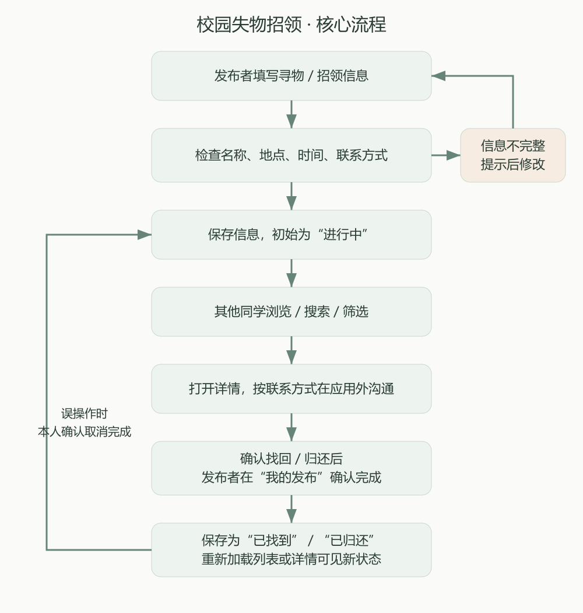
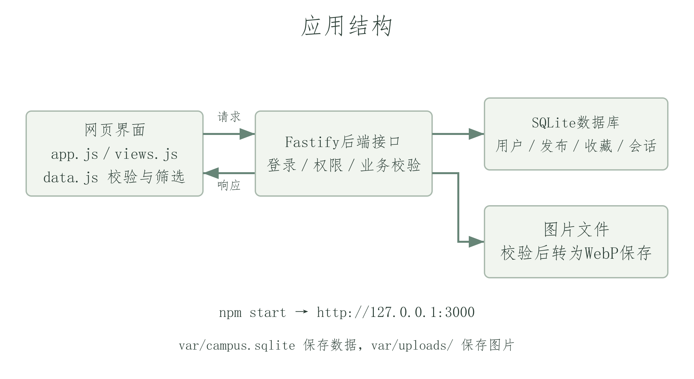
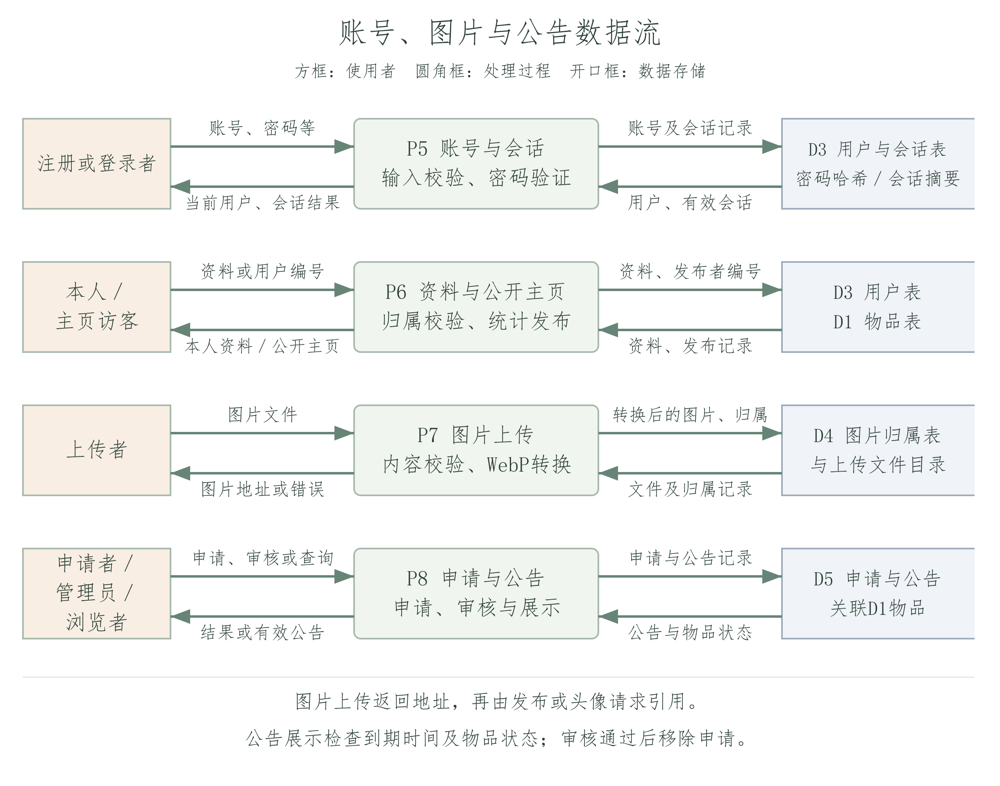
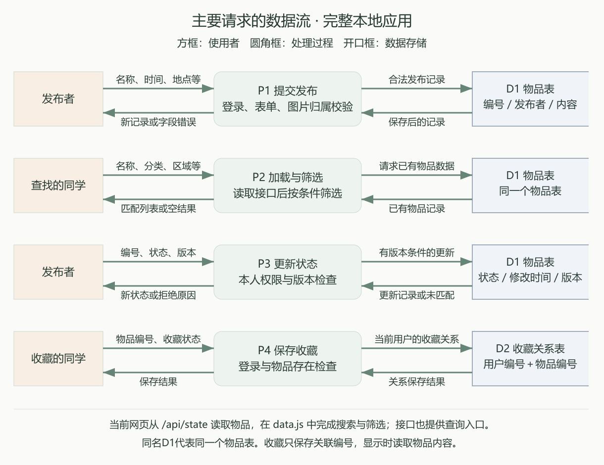
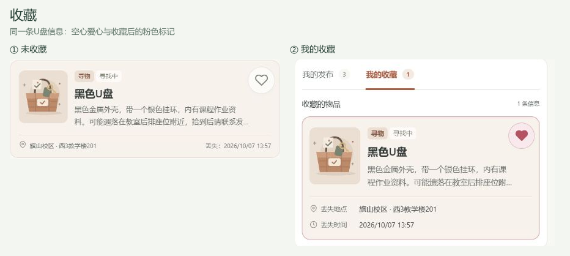
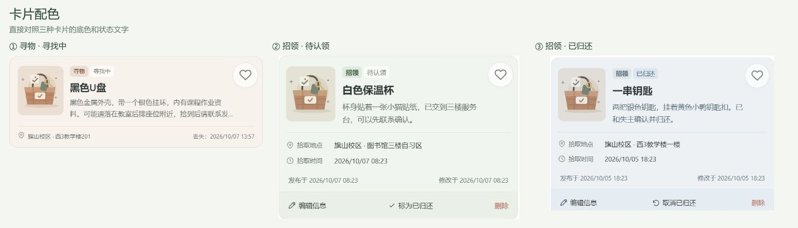
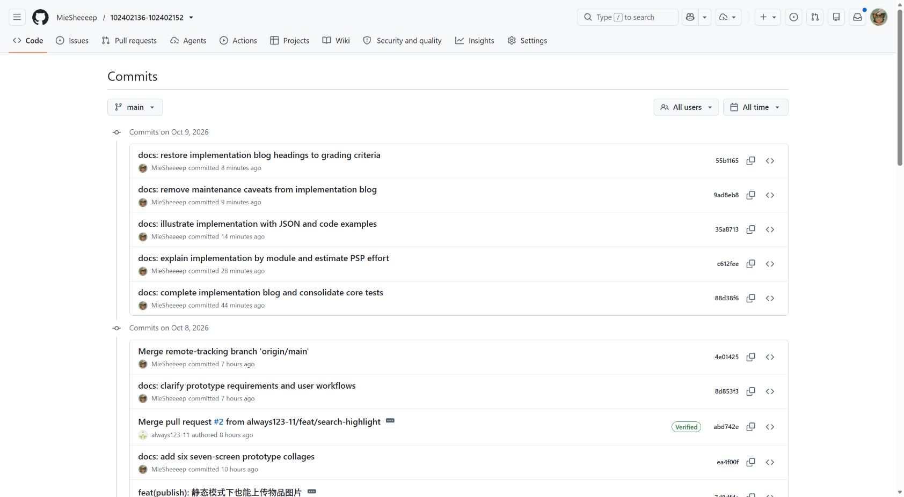
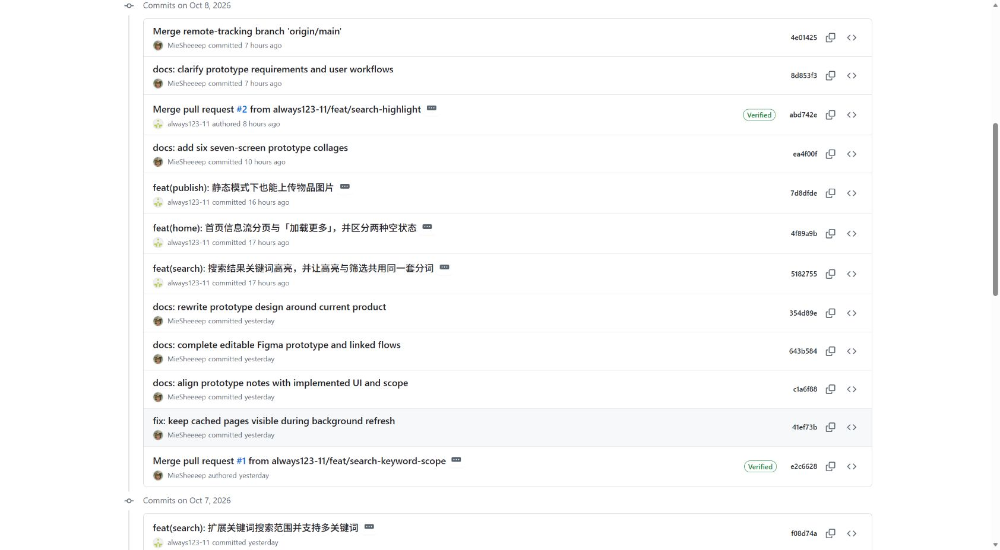

# 2026秋软件工程结对作业（第二次）：校园失物招领程序实现

## 一、作业链接与结对信息（2分）

| 项目 | 内容 |
| --- | --- |
| 课程 | [H202601软件工程与软件工程实践](https://edu.cnblogs.com/campus/fzu/2026-01SoftwareEngineeringandSoftwareEngineeringPractice) |
| 作业要求 | [2026秋软件工程结对作业（第二次）](https://edu.cnblogs.com/campus/fzu/2026-01SoftwareEngineeringandSoftwareEngineeringPractice/homework/16745) |
| 作业目标 | 根据上次的需求和原型，做出可以实际操作的校园失物招领程序，并完成测试 |
| 结对成员 | 王智洋（102402136）、庄剑钇（102402152） |
| 队友博客 | [庄剑钇的博客](https://www.cnblogs.com/always111/) |
| 本篇文档 | [程序实现博客正文](https://github.com/MieSheeeep/102402136-102402152/blob/main/docs/2026-10-07-implementation-blog.md) |
| GitHub项目 | [102402136-102402152](https://github.com/MieSheeeep/102402136-102402152) |
| 上次需求与原型 | [校园失物招领：需求分析与原型设计](https://www.cnblogs.com/MieSheeeep/p/23138166) |

## 二、具体分工（1分）

| 成员 | 负责的模块与工作 |
| --- | --- |
| 王智洋（102402136） | 发布、浏览、详情和状态管理的主体功能；收藏、筛选、公告和个人资料；本地后端、数据库与图片存储；界面调整、测试和文档整理 |
| 庄剑钇（102402152） | 描述、地点与多关键词搜索；关键词高亮；首页加载更多和空结果区分；静态模式图片压缩与保存，以及相关测试 |

我们先统一数据结构和业务模块，再各自改代码、通过PR合并，最后一起跑测试。AI也帮忙写代码和排查问题，改完还是要自己点一遍、测一遍。

## 三、PSP表格与耗时分析（5分）

这里记的是两人合计的大致耗时，两个人一起干一小时，就算120人分钟。计划、开发和报告行是小计，不重复计入总计。

| PSP2.1 | 任务 | 预估耗时（约） | 实际耗时（约） |
| --- | --- | ---: | ---: |
| Planning | 计划 | 20 | 30 |
| Estimate | 确认交付范围与任务分工 | 20 | 30 |
| Development | 开发 | 930 | 1390 |
| Analysis | 梳理需求，学习Mocha、接口、SQLite和图片处理 | 90 | 130 |
| Design Spec | 整理字段、状态、权限和运行方式 | 60 | 80 |
| Design Review | 检查筛选、卡片、公告和导航设计 | 30 | 70 |
| Coding Standard | 确定模块划分、转义和校验规则 | 20 | 20 |
| Design | 设计页面交互与数据关联 | 100 | 150 |
| Coding | 实现网页、本地后端及配套功能 | 420 | 620 |
| Code Review | 阅读代码，核对接口、权限与队友改动 | 60 | 80 |
| Test | 验证业务、接口和页面，修改问题 | 150 | 240 |
| Reporting | 报告 | 100 | 160 |
| Test Report | 整理测试输入、预期和结果 | 30 | 50 |
| Size Measurement | 核对模块、功能与测试工作量 | 20 | 30 |
| Postmortem & Process Improvement Plan | 整理博客、配图与改进建议 | 50 | 80 |
| 合计 | 以上具体任务之和 | **1050** | **1580** |

本来觉得发布、搜索能跑通就差不多了，账号、数据库和图片保存又多花了约200分钟。测试多约90分钟，主要检查换账号、重启和手机布局；筛选面板和图片控件的调整又多约90分钟。最后比预估多约530人分钟，小细节还挺费时间。

## 项目介绍与展示

[项目介绍、页面展示和运行说明](https://github.com/MieSheeeep/102402136-102402152#readme)放在仓库README中。

## 四、解题思路描述与设计实现说明（20分）

### 4.1 解题思路

寻物和招领其实都在说同一件事：什么东西、在哪里、什么时候。所以我们共用一张物品表，用`type`区分丢了还是捡到了；首页、详情和“我的发布”按同一个编号读记录，改完再获取一次数据。

校验和筛选放进`data.js`，只接收数据、返回结果，不读取DOM。页面、后端和Mocha都能调用，规则写一遍就够了，少给自己留几处漏改的机会。



### 4.2 整体结构

页面通过`api.js`提交数据，后端处理账号和写入，筛选等计算放在`data.js`；界面改动不需要跟着改数据库读写。

一开始先用静态页面和浏览器存储把功能跑起来，后来接上Fastify和SQLite，才有了账号登录、共享数据和图片文件保存。总不能我发布了东西，只有我自己看得见吧。



`app.js`按`#home`、`#publish`、`#detail/编号`选择页面，`views.js`生成HTML。重绘会替换按钮，所以把点击监听放在不会被替换的主容器上，用`event.target.closest('[data-action]')`找到按钮并分发操作；底部导航也放在重绘区域外。

| 文件 | 具体职责 |
| --- | --- |
| `js/app.js` | 路由、事件监听、表单草稿、弹窗、页面状态与刷新 |
| `js/views.js` | 卡片、详情、表单等页面模板，用户文字转义和关键词高亮 |
| `js/data.js` | 输入校验、创建与更新记录、搜索筛选、收藏和状态规则 |
| `js/api.js` | 请求接口、处理响应错误、上传图片和携带登录凭据 |
| `server/app.cjs` | 登录会话、接口校验、权限判断、数据库与图片读写 |

每切一次页面都闪“正在加载”，看着确实烦。我们改成先显示当前`state`，后台再更新；请求序号每次递增，只接收最新序号的响应，旧请求就算晚到也不再改页面。

后端保存密码的加盐哈希，通过HttpOnly Cookie识别登录用户，写操作检查CSRF凭据。游客可浏览，发布、收藏和查看联系方式需要登录。

### 4.3 数据组织

`/api/state`返回的物品、收藏与偏好数据：

```json
{
  "items": [
    {
      "id": "post-demo-umbrella",
      "ownerId": "user-demo-student",
      "version": 1,
      "type": "lost",
      "name": "黑色长柄雨伞",
      "category": "生活用品",
      "locationGroups": ["教学楼", "图书馆"],
      "locationGroup": "教学楼",
      "locationDetail": "教学楼A区302附近",
      "occurredAt": "2026-10-08T08:20",
      "timePrecision": "datetime",
      "contact": "微信：campus_demo",
      "description": "伞柄有一圈银色金属环",
      "image": "assets/default-item.svg",
      "status": "open",
      "createdAt": "2026-10-08T01:00:00.000Z",
      "updatedAt": "2026-10-08T01:00:00.000Z"
    }
  ],
  "favorites": ["post-demo-umbrella"],
  "recentSearches": ["黑色 雨伞"],
  "preferences": { "sort": "newest", "saveSearchHistory": true }
}
```

昨天丢的东西，今天才发消息，也应该能按昨天搜到，所以筛选用`occurredAt`。记不清具体时间地点也很正常，`timePrecision`和`locationGroups`就用来存大致日期和可能区域；编辑时带上`version`，后端再检查有没有人先改过。

昵称和头像只存用户表，发布关联用户编号，换头像就不用把每条旧发布都改一遍。收藏也只存物品编号；图片另存文件，JSON里放地址，没必要每次请求列表都把照片塞进去。

| 数据表 | 保存内容 | 与其他数据的联系 |
| --- | --- | --- |
| `users`、`sessions` | 账号资料、密码及恢复码摘要、偏好、会话 | 会话关联用户；发布、收藏、图片以用户编号确定归属 |
| `items` | 物品编号、发布者编号、内容、版本 | 发布者资料从用户表读取；完成数量从物品状态统计 |
| `favorites` | 用户编号、物品编号 | 两个编号组成唯一关系；删除物品后级联删除 |
| `uploads`与图片目录 | 图片编号、所属用户、大小和文件 | 物品及头像引用图片地址 |
| `urgent_requests`、`notices` | 申请或公告所关联物品、酬谢；公告另存到期时间 | 关联原发布；审核批准时写公告并删除申请 |
| `app_meta` | 演示初始化及资料迁移标记 | 启动时读取标记，已初始化就跳过导入 |



第一次启动会放入演示账号、七条物品和三条公告，让页面不至于空空的。之后读已有数据，重启不会把刚发布的东西洗掉；需要备份时用`server/backup.cjs`。

### 4.4 发布与保存

漏填就直接在输入旁提醒，不让用户猜哪里错了。前后端都调用`validateItem()`：前端方便修改，后端检查绕过表单发来的请求；提交时暂时禁用按钮，失败后保留输入，免得还要重填一遍。

图片通过`POST /api/uploads`返回地址，再随表单提交到`POST /api/items`。服务器再次校验，从登录会话取得发布者编号，保存后才返回成功。

`app.js`中的后端提交逻辑：

```javascript
requireLogin();
if (pendingItemFile) draft.image = await API.upload(pendingItemFile);
const edit = currentRoute.page === 'edit';
const record = await API.request(
  edit ? 'PATCH' : 'POST',
  edit ? `/items/${encodeURIComponent(currentRoute.id)}` : '/items',
  {
    ...draft,
    ...(edit ? {
      version: state.items.find(post => post.id === currentRoute.id)?.version
    } : {})
  }
);
await refreshRemote(false);
navigate(edit ? 'my' : `success/${encodeURIComponent(record.id)}`);
```

这里先上传图片，是因为物品记录里要放它的地址。拿到地址再提交物品，保存成功才刷新并跳转；中途出错就进`catch`提示，`finally`恢复按钮，不能没存上就先说“发布成功”。

上传接口用Sharp读取实际图片格式，不按文件后缀判断；随后修正旋转方向、按比例缩到1600×1600以内，以质量82转为WebP，统一图片格式和尺寸。



### 4.5 搜索与列表

首页读取`/api/state`，再用`queryItems()`筛选。关键词按空白拆分、忽略大小写，每个词都需命中名称、描述或具体地点：

```javascript
function splitKeywords(value) {
  return text(value).toLocaleLowerCase().split(/[\s\u3000]+/).filter(Boolean);
}

function matchesKeywords(item, words) {
  if (!words.length) return true;
  const haystack = [item.name, item.description, item.locationDetail]
    .map(text).join('\n').toLocaleLowerCase();
  return words.every(word => haystack.includes(word));
}
```

搜“雨伞 金属环”时，两个词都要找到，但不必挤在同一个字段里。名称有雨伞、描述有金属环就能命中，这就是这里用`every()`的原因。

多选采用组内任选、组间同时满足：选“教学楼、食堂”加“生活用品”，表示这两个地点中任一处的生活用品。日期按丢失／拾取时间筛选，包含起止两天；排序按发布时间。

筛选面板编辑`filterDraft`，点击应用才复制到正式条件，用户可以一次选完地点和分类。列表先算匹配结果，再截取前12条；加载更多增加上限，换条件则恢复12条。高亮先转义原文再加入`mark`，输入中的HTML标签会显示为文字。

### 4.6 编辑与状态同步

编辑直接复用发布表单，不再另写一套，通过`PATCH /api/items/:id`提交内容和版本号。他人的发布改不了（403），旧版本也不能直接覆盖（409），原编号、发布者、类型和发布时间不变。

完成与取消完成分别将`status`设为`completed`和`open`，卡片及个人统计都从这个字段读取。完成、取消完成和删除前需确认。

`server/app.cjs`中的更新接口：

```javascript
const user = auth(req);
const old = getItem(req.params.id, user);
const body = req.body || {};
if (old.ownerId !== user.id) fail(403, '只能管理本人发布的信息');
if (body.version !== old.version) fail(409, '信息已被修改，请刷新后重试');
let item;
if (body.status !== undefined) {
  if (!['open', 'completed'].includes(body.status)) fail(400, '状态不正确');
  item = (body.status === 'completed' ? D.completeItem : D.reopenItem)
    ([old], old.id, user.id)[0];
}
```

`auth(req)`从会话取得用户，`old.ownerId`与用户编号不相等就返回403；版本不同返回409。页面是否显示编辑按钮不参与权限判断。

写入数据库时，再把版本条件放进更新语句：

```javascript
const result = db.prepare(
  'UPDATE items SET data=?,version=version+1 WHERE id=? AND version=?'
).run(JSON.stringify(item), old.id, old.version);
if (!result.changes) fail(409, '信息已被修改，请刷新后重试');
return getItem(old.id, user);
```

比如开着两个页面，都读到版本1：第一个保存后变成2，第二个再用`WHERE version=1`就找不到记录，`result.changes`为0，返回409。把版本条件写进同一条SQL，后保存的人就得先看看新内容，不能直接把前一次修改盖掉。

## 五、附加特点设计与展示（10分）

### 5.1 收藏

“好像是我的，先记下来！”看到可能相关的物品，点个小爱心就能留下线索，之后从首页“收藏”或“我的收藏”找回来，不用再翻半天列表。

收藏只存物品编号，查看时再读取内容，所以发布者补充了线索，收藏里也能看到。

收藏表以“用户编号＋物品编号”为联合主键，接口使用`INSERT OR IGNORE`，重复收藏同一物品只留一条关系；外键的`ON DELETE CASCADE`在物品删除时清除关系。页面先计算目标状态，再通过`PUT`提交`active: true/false`，重发请求也不会把收藏反向切换。

页面中的编号数组用以下函数切换：

```javascript
function toggleFavorite(favorites, id) {
  return favorites.includes(id)
    ? favorites.filter(value => value !== id)
    : [...favorites, id];
}
```

收藏成功，小爱心变成粉色并轻轻跳一下，卡片也加上粉色边框，告诉你“记住啦”。取消时恢复空心，收藏列表里的卡片淡出移除。



### 5.2 紧急公告栏

有些东西真的等不了，比如装着作业的U盘。我们在首页顶部留了一块紧急公告栏，让着急找东西的同学先被看见。

公告只突出图片、丢失时间、地点和酬谢，扫一眼就知道要找什么、去哪儿留意；左右滑动看下一条，想帮忙就点进去看详情。

ps：如果真上线，我们也可以从这些急寻抽佣金（趁人之危，bushi，哈哈哈哈哈），流量大了也可能广告位招租呢？

公告关联原发布，管理员设置酬谢和到期时间；到期或物品完成后不再展示。“联系我们发布紧急”打开团队联系弹窗，提供微信`campus_demo`和需提交的信息。


### 5.3 颜色提示

刷列表时，不用每张卡片都仔细读：暖棕色是“我丢东西啦”，浅绿色是“我捡到东西啦”，灰蓝色是“已经找到或归还啦”。收藏的小爱心和边框用粉色，自己的线索也容易认出来。

颜色调得柔和一些，长时间看也不会满屏抢眼；卡片上仍有类型和状态文字，看不清颜色也能读懂。

一条招领信息归还后，卡片就变成灰蓝色，写着“已归还”；如果你收藏过它，小爱心还会留着。

`statusLabel()`根据类型和完成状态生成文字，页面据此设置卡片样式。

```javascript
function statusLabel(item) {
  if (item.status === 'completed') {
    return item.type === 'lost' ? '已找到' : '已归还';
  }
  return item.type === 'lost' ? '寻找中' : '待认领';
}
```

`css/styles.css`中，已完成规则放在类型配色后面：

```css
.item-card.completed-card {
  background: #edf1f4;
  border-color: #d2dce3;
}
.item-card.has-favorite {
  border-color: #c8929c;
  box-shadow: inset 0 0 0 1px #b653621a;
}
```

状态控制卡片底色，收藏控制边框和爱心，两种提示可以同时出现。



还有一些顺手的小设计：筛选可以多选，点应用后面板不收起，方便继续调整；最近搜索不用重复输入，匹配词会高亮。联系方式可以复制，照片能预览、更换和移除；漏填就直接在输入旁提醒，完成、取消完成和删除前再问一句，底部导航也一直留着。

## 六、目录说明和使用说明（5分）

### 6.1 目录组织

```text
index.html                 页面入口、主导航和弹窗容器
css/styles.css             页面样式、动效和适配
assets/                    默认配图和头像
js/seed.js                 静态体验的初始数据
js/data.js                 校验、筛选、收藏和状态规则
js/views.js                页面渲染与文字转义
js/app.js                  导航、表单和交互
js/api.js                  后端接口访问
js/feedback.js             点击反馈
server/                    API、数据库、图片与演示数据初始化
tests/                     单元测试和接口测试
e2e/                       Chrome页面流程测试
docs/                      原型记录、设计及测试说明
var/                       运行后生成的数据库与图片，不提交Git
package.json               依赖和运行命令
README.md                  使用说明
```

### 6.2 运行方式

下载并解压完整项目，安装Node.js 24.19及以上的24.x版本，在项目目录执行：

```powershell
npm.cmd ci
npm.cmd start
```

用Chrome打开`http://127.0.0.1:3000`就能体验。懒得注册的话，直接用`demo_student`、密码`CampusDemo123!`，里面已有三条发布和两条收藏。

数据库位于`var/campus.sqlite`，图片位于`var/uploads/`。结束程序后，下次运行同样的命令即可继续使用。

第一次运行可以按这个顺序体验：发布一条信息→首页按名称搜索→打开详情→查看联系方式→“我的发布”标记完成→回首页确认状态→取消完成。再试一次必填项为空和搜索无结果。

## 七、单元测试（10分）

### 7.1 Mocha简易教程

测试先从小函数开始，不用一上来就把整个网页打开。我们的业务函数能直接在Node.js里跑，就用Mocha组织用例、`node:assert/strict`比较结果，接口请求则配上`async/await`。

学习参考[Mocha入门文档](https://mochajs.org/getting-started/)，从一个函数的输入和预期结果开始写用例。

#### 安装Mocha

在已有Node.js项目中安装：

```powershell
npm.cmd install --save-dev mocha
```

本项目已配置Mocha，下载后执行`npm.cmd ci`即可。

Mocha负责组织和运行测试，断言负责比较实际结果与预期：`describe()`分组，`it()`定义用例，`assert.equal()`比较单个值，`assert.deepEqual()`比较数组或对象。断言不相等时，用例失败并显示差异。

#### 例子一：收藏

将收藏测试保存为`docs/favorite-example.test.cjs`：

```javascript
const { describe, it } = require('mocha');
const assert = require('node:assert/strict');
const D = require('../js/data.js');

describe('收藏', () => {
  it('favorite toggle adds once then removes', () => {
    const before = [];
    const after = D.toggleFavorite(before, 'one');
    assert.deepEqual(after, ['one']);
    assert.deepEqual(D.toggleFavorite(after, 'one'), []);
  });
});
```

这个用例检查第一次点击加入编号、第二次点击移除。在项目根目录运行：

```powershell
npm.cmd exec -- mocha docs/favorite-example.test.cjs
```

看到`1 passing`就说明通过了。也可以故意把第一次的预期改成`[]`，看看失败报告长什么样，记得再改回`['one']`。

#### 例子二：日期筛选

选了1号到6号，6号晚上丢的东西当然也要算。这个用例就检查起点、终点、范围外和没填时间的情况。

将下面代码接在同一个练习文件后，复用前面的导入。`item(overrides)`只修改要测试的字段：

```javascript
const now = '2026-10-06T10:00:00.000Z';
const input = {
  type: 'lost', name: '黑色雨伞', category: '生活用品',
  locationGroup: '教学楼', locationDetail: 'A区302',
  occurredAt: '2026-10-06T09:20', contact: '微信：demo',
  description: '银色金属环'
};
function item(overrides = {}) {
  return {
    id: 'one', ownerId: 'me', ...input, status: 'open',
    createdAt: now, updatedAt: now, ...overrides
  };
}

it('event date range includes both ends and uses the event date', () => {
  const list = [
    item({ id: 'first', occurredAt: '2026-10-01', timePrecision: 'date' }),
    item({ id: 'last', occurredAt: '2026-10-06T23:59' }),
    item({ id: 'old', occurredAt: '2026-09-30T12:00' }),
    item({ id: 'unknown', occurredAt: '', timePrecision: 'unknown' })
  ];
  const ids = D.queryItems(list, {
    timeRange: 'custom', dateStart: '2026-10-01', dateEnd: '2026-10-06'
  }).map(x => x.id);
  assert.deepEqual(ids, ['first', 'last']);
  assert.equal(D.queryItems(list, { timeRange: 'all' }).length, 4);
});
```

四条记录的发布时间相同，丢失时间不同，预期只留下起点和终点两条，可同时发现边界遗漏和时间字段用错。固定日期让测试结果可重复，比较编号只检查筛选结果。

再次运行同一命令，两个用例通过时显示`2 passing`。

### 7.2 测试数据构造

自己用的时候总会按正常顺序点，测试就得故意找点麻烦：全填空格呢？换个账号呢？两个页面一起改呢？我们按代码分支准备数据，每组只改相关字段，失败了比较容易找到原因。

| 检查方向 | 为什么这样构造 | 数据与预期 |
| --- | --- | --- |
| 必填输入 | 看起来填了内容，去掉空白后却可能为空 | 名称全为空格、联系方式为换行，预期指出字段错误 |
| 搜索组合 | 单个词能命中，不代表多个词的关系正确 | 名称有“雨伞”、描述有“金属环”，两个词同时命中；不存在的词排除记录；兼容大小写和全角空格 |
| 多选条件 | 防止把组内任选写成全部满足，或忽略组间组合 | 四条不同地点、分类记录，地点组取并集，再与分类组取交集 |
| 展示数量 | 正常第一页之外还可能有空集合和异常限制 | 30条记录限制12／24条，检查剩余数量；空集合、负数和小数检查处理规则 |
| 文本显示 | 正常中文无法发现转义错误 | 输入带标签、引号、事件属性和正则字符的文字，预期显示文字并保留正确高亮 |
| 状态修改 | 同一完成状态在寻物和招领上有不同文案 | 分别构造两种类型，取消完成后状态恢复，内容与发布时间保留 |
| 图片 | 扩展名和真实内容可能不一致 | 文件名为PNG但内容是SVG，预期拒绝；有效PNG返回WebP；本地图片保存后仍可读取 |
| 账号权限 | 只用本人账号看不到越权问题 | A发布、B修改和删除，预期403；B收藏不改变A的收藏 |
| 旧数据覆盖 | 同一个账号也可能同时开两个页面 | 完成后拿旧版本取消完成，预期409；新版本可以成功 |
| 持久化与关联 | 页面上暂时显示成功，不等于重启后还在 | 重启后读取发布和收藏；删除物品后关联收藏清除 |

针对连续点击、空白输入和跨账号修改等操作，既检查成功结果，也检查应返回的400、403和409。

Chrome测试用两个隔离账号走完整操作流程，并在390px和1200px宽度下检查溢出及底栏。弹窗操作等待动画结束后再判断结果。

### 7.3 测试分组与运行结果

共29项测试：

| 测试组 | 数量 | 检查范围 |
| --- | ---: | --- |
| 业务规则 | 8 | 表单、关键词、图片保存、收藏、状态、多选、分批数据、日期 |
| 视图与文本安全 | 5 | 用户文字与表单属性转义、高亮、分批展示、图片展示 |
| 后端接口 | 8 | 登录、权限、资料、状态、持久化、Cookie／CSRF、图片、编辑 |
| 演示数据初始化 | 1 | 账号、七条物品、三条公告及初始化后的资料 |
| Chrome页面流程 | 7 | 注册、底栏、带图发布、资料主页、完成取消、编辑、删除 |
| 合计 | **29** | 业务结果、数据保存与页面操作 |

2026年10月9日运行结果：

```text
npm test              22 passing
npm run test:browser   7 passing
npm run check         语法检查通过
```

测试代码：[tests目录](https://github.com/MieSheeeep/102402136-102402152/tree/main/tests)、[e2e目录](https://github.com/MieSheeeep/102402136-102402152/tree/main/e2e)。

## 八、GitHub代码签入记录截图（1分）

[GitHub提交记录](https://github.com/MieSheeeep/102402136-102402152/commits/main/)

<a href="blog-images/2026-10-07/git-commits-2026-10-09.jpg"></a>

<a href="blog-images/2026-10-07/git-features-2026-10-09.jpg"></a>

## 九、代码模块异常或结对困难及解决方法（4分）

这个问题挺折腾：调整图片上传区域后，一进发布页，底栏就不见了。我们先怀疑定位，改着改着底栏又开始乱跑，方向找错了。

后来量了页面宽度才发现，隐藏的文件输入框吃到了普通表单的`width: 100%`样式，把页面撑宽了。看不见归看不见，它还是占地方，底栏就跟着跑出可见范围。

最后保留底栏的固定定位，为上传区域增加相对定位，并限制隐藏控件的尺寸：

```css
.item-image-editor { position: relative; }
.form-field input.sr-only {
  position: absolute;
  width: 1px;
  height: 1px;
  max-width: 1px;
  min-width: 0;
  padding: 0;
  overflow: hidden;
}
```

测试也跟着修改：横向溢出比较页面的`scrollWidth`和`documentElement.clientWidth`。原先比较`innerWidth`，它也可能随页面撑宽，导致测试漏报。随后把发布页纳入手机宽度检查。

修完后，390px和1200px下都没有横向溢出，底栏正常，7项Chrome测试通过。这次记住了：先量布局再改定位，别一看底栏没了就只盯着底栏。

## 十、评价队友（2分）

队友把描述与地点搜索、关键词高亮、加载更多和静态图片保存补上了。比较佩服的是他不只把功能做出来，还带上测试，连高亮转义、筛选后数量重置这些小地方也考虑到了。

下次我们得记得代码和文档一起改，别功能已经有了，README还停在上一版。PR里的复核意见和PSP耗时也及时记一下，不然最后写博客，又得翻记录找半天。
