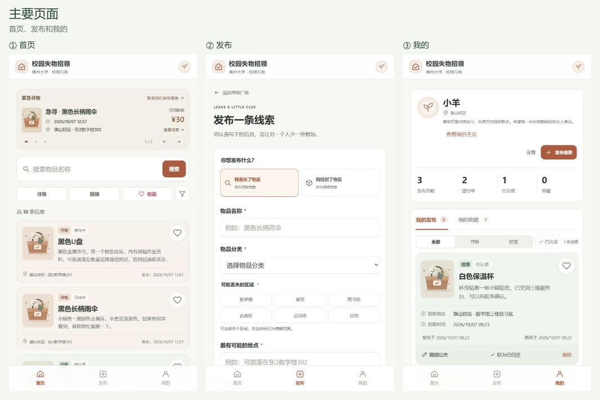
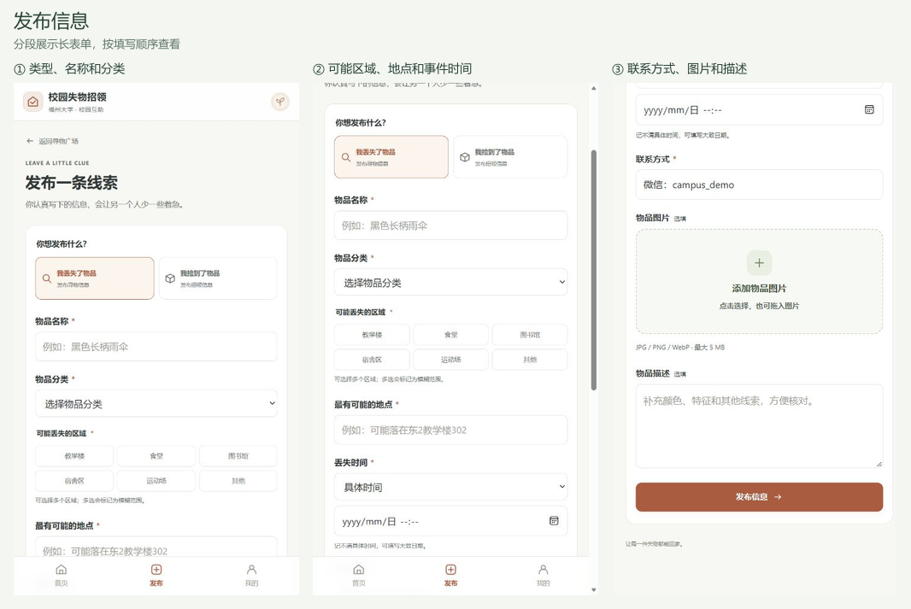
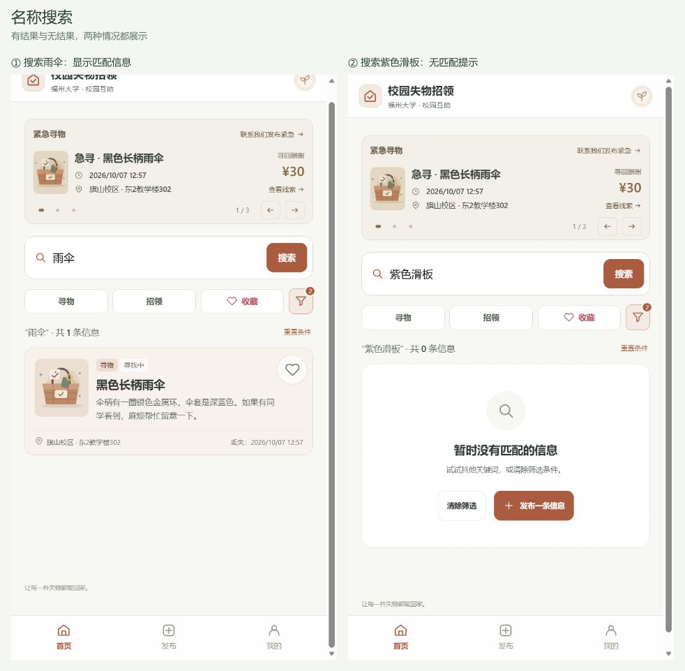
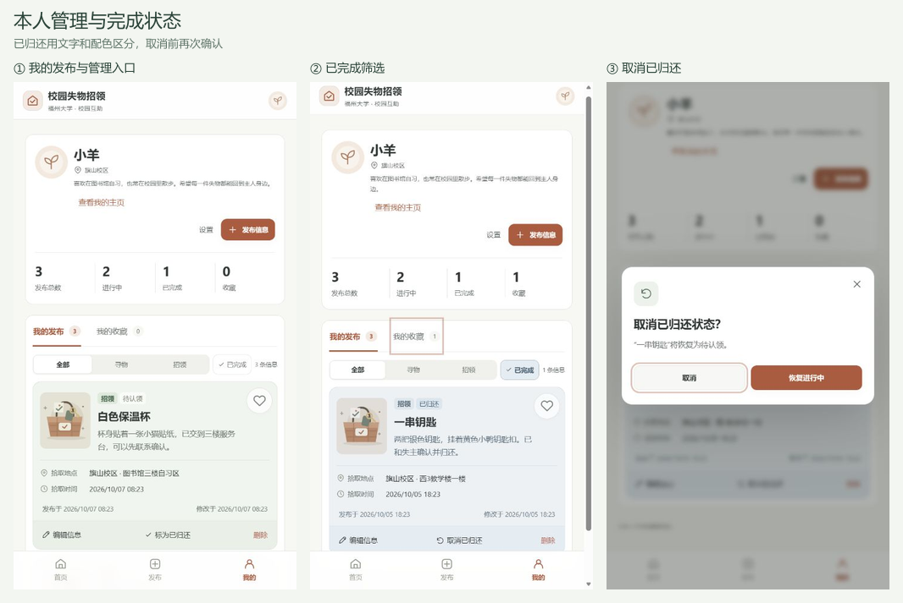
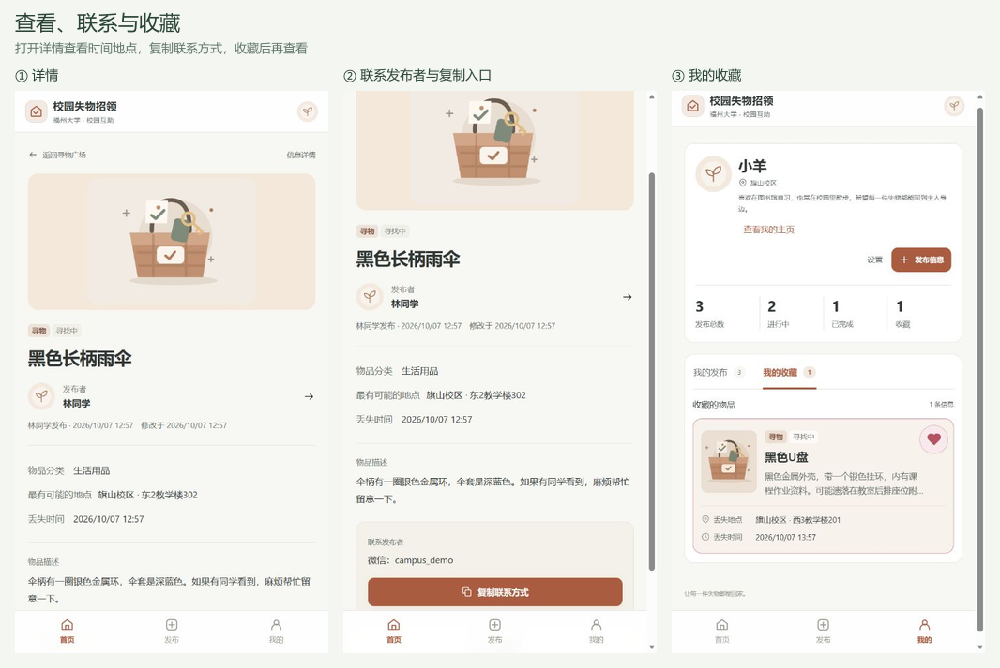
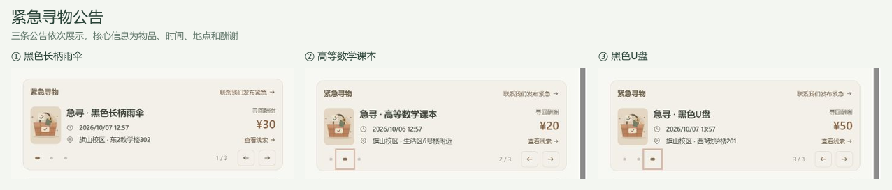
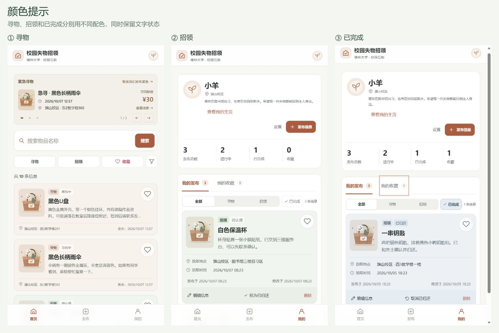
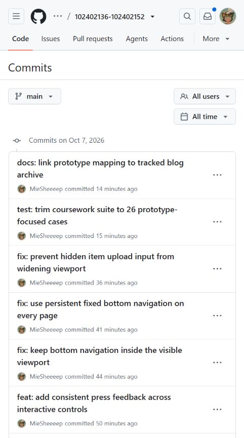

# 2026秋软件工程结对作业（第二次）：校园失物招领程序实现

## 一、作业链接与结对信息

| 项目 | 内容 |
| --- | --- |
| 课程 | [H202601软件工程与软件工程实践](https://edu.cnblogs.com/campus/fzu/2026-01SoftwareEngineeringandSoftwareEngineeringPractice) |
| 作业要求 | [2026秋软件工程结对作业（第二次）](https://edu.cnblogs.com/campus/fzu/2026-01SoftwareEngineeringandSoftwareEngineeringPractice/homework/16745) |
| 作业目标 | 根据上次的需求和原型，做出可以实际操作的校园失物招领程序，并完成测试 |
| 结对成员 | 王智洋（102402136）、庄剑钇（102402152） |
| 队友博客 | [庄剑钇的博客](https://www.cnblogs.com/always111/) |
| 本篇文档 | [程序实现博客正文](https://github.com/MieSheeeep/102402136-102402152/blob/main/docs/2026-10-07-implementation-blog.md)，目前保存于仓库 |
| GitHub项目 | [102402136-102402152](https://github.com/MieSheeeep/102402136-102402152) |
| 上次需求与原型 | [校园失物招领：需求分析与原型设计](https://www.cnblogs.com/MieSheeeep/p/23138166) |

## 二、两人工作分工（1分）

本次分工根据开发记录和Git提交整理。王智洋负责主体功能、界面调整与文档，庄剑钇通过fork和PR补充查找、列表和静态图片功能。开发中使用AI辅助，两人的成果以代码和提交记录为依据。

| 成员 | 本次负责的具体工作 | 协作记录 |
| --- | --- | --- |
| 王智洋 | 搭建发布、浏览、详情、状态管理的核心流程；完成收藏、筛选、公告、个人资料、本地后端与图片存储；调整界面和底栏；整理测试、README和本篇文档 | `34f51c9`完成MVP，`a0fdf8a`接入本地后端，`e638004`修复发布页溢出，`41ef73b`减少页面切换闪动；主仓库接收队友PR |
| 庄剑钇 | 扩展名称、描述、地点搜索与多关键词匹配；实现关键词高亮、首页加载更多及空结果区分；补充静态模式图片压缩与保存，以及相关测试 | [PR #1](https://github.com/MieSheeeep/102402136-102402152/pull/1)、[PR #2](https://github.com/MieSheeeep/102402136-102402152/pull/2)，来自[队友fork](https://github.com/always123-11/102402136-102402152) |

## 三、PSP表格与耗时分析（5分）

本次没有保存完整的分阶段预估和计时记录，因此不能给出准确的分钟数。下表按PSP2.1整理实际工作内容，耗时统一记为“未记录”；分类标题不参与合计。上次原型的420／615分钟不计入本次程序开发，Git提交间隔也不当作工作时间。

| PSP2.1 | 任务 | 预估耗时 | 实际耗时 |
| --- | --- | ---: | ---: |
| Planning | 计划 | — | — |
| Estimate | 确认交付范围与开发顺序 | 未记录 | 未记录 |
| Development | 开发 | — | — |
| Analysis | 梳理核心流程，学习Mocha、接口、SQLite和图片处理 | 未记录 | 未记录 |
| Design Spec | 整理字段、状态、权限和运行方式 | 未记录 | 未记录 |
| Design Review | 根据实际页面反馈调整筛选、卡片、公告和导航 | 未记录 | 未记录 |
| Coding Standard | 区分业务、视图与接口，统一转义和校验规则 | 未记录 | 未记录 |
| Design | 设计资料、发布、收藏、图片与数据库关联 | 未记录 | 未记录 |
| Coding | 完成网页、本地后端及队友两次PR中的功能 | 未记录 | 未记录 |
| Code Review | 核对修改与测试，接收PR；没有正式评审意见记录 | 未记录 | 未记录 |
| Test | 验证业务、接口和页面流程，排查底栏与图片问题 | 未记录 | 未记录 |
| Reporting | 报告 | — | — |
| Test Report | 整理29项测试的输入、预期与运行结果 | 未记录 | 未记录 |
| Size Measurement | 按模块和Git提交核对工作范围 | 未记录 | 未记录 |
| Postmortem & Process Improvement Plan | 复盘返工、分工与记录不足，编写博客 | 未记录 | 未记录 |
| 合计 | 无法据现有记录准确合计 | 未记录 | 未记录 |

没有计时记录，无法计算各阶段差了多少分钟，但可以从实际修改中分析返工原因。筛选先后调整了外露选项、多选、日期范围、应用后保持展开和滚动布局；图片区域修改后，又排查了隐藏控件撑宽页面导致的底栏问题。最初只检查单个页面外观，后来才把跨页面状态和手机宽度纳入检查，增加了修改和验证工作。

下一次应先确定每个功能的验收条件，再开始编码。例如筛选同时约定匹配规则、应用与关闭行为，发布页同时检查输入错误、图片保存和底栏位置。两人分别记录开始、结束和中断时间，以个人分钟统计，再汇总人分钟；每完成一项就更新PSP，避免写报告时只能回忆。

## 四、设计实现过程（20分）

### 4.1 设计和实现过程（5分）

上次作业画出了页面和操作流程，这次把它做成了网页。我们先做发布、浏览、搜索、查看详情和修改状态，再补筛选、收藏、个人主页等功能。

比如，一位同学丢了雨伞，可以发布名称、丢失时间、可能丢失的地方和联系方式。另一位同学在首页搜索“雨伞”，打开详情后联系发布者。确认找回以后，由发布者到“我的发布”标记“已找到”。如果是捡到物品，归还后标记“已归还”。其他人重新加载列表或打开详情时，也能看到更新后的状态。

这次实现的是网页。上次原型使用小程序的页面形式，因此保留了“首页、发布、我的”三个入口。当前没有实现原生微信小程序，也没有做站内聊天、地图定位或学校实名认证。联系双方需要根据详情中的联系方式，在应用外沟通。

开发中使用了AI辅助编写代码、整理测试和排查样式问题。下面的功能、代码和测试结果均对应实际项目；两人的协作过程和耗时按真实记录填写。

#### 开发顺序与实现选择

先完成本地核心流程，再补接口和多账号，最后根据页面反馈修改布局与交互。对应的提交分别有`34f51c9`（MVP）、`a0fdf8a`（本地后端与发布者主页）、`e638004`（上传控件造成的页面溢出修复）。这样每一阶段都有可以运行和检查的结果。

前端采用普通HTML、CSS和JavaScript，主要考虑老师要求下载后用Chrome直接打开HTML。业务规则单独放在`data.js`，界面放在`views.js`，交互由`app.js`连接；后端接入时通过`api.js`调用接口，继续使用原来的页面与业务规则。后端使用SQLite，便于在一台电脑上运行和保存数据。

| 模块 | 负责什么 | 一个具体例子 |
| --- | --- | --- |
| 页面与交互 | 收集输入、展示信息、给出提示 | 必填地点为空时，在该字段旁说明问题 |
| 业务规则 | 校验、筛选、状态变化 | 寻物完成显示已找到，招领完成显示已归还 |
| 接口 | 确定当前账号、检查权限、读写数据 | 只有发布者本人能完成或取消完成 |
| 数据库与图片文件 | 保存发布、收藏、账号及照片 | 重启后仍能查看之前的发布与收藏 |

#### 从原型到页面

**第一步：确定每条信息要保存什么。** 原型中有物品名称、图片、地点和时间，开发时需要先把这些内容变成数据字段。每条发布都有独立编号和发布者编号，类型分为寻物与招领，进度分为进行中与已完成。首页、详情、我的发布和收藏都根据同一条记录生成，避免几个页面各存一份内容，修改后互相对不上。

这里也调整了原型中的表达。丢失或拾取时间保存为事件时间，发布时间和修改时间另外记录，筛选按事件日期判断。寻物地点允许多选可能区域，并注明“模糊范围”；补充输入改为“最有可能的地点”。招领仍选择一个拾取区域，避免把不确定的丢失范围写成确定的拾取位置。

**第二步：接通页面、数据和按钮。** `index.html`提供顶部栏、主内容区、底部导航和弹窗容器。`app.js`读取地址中的`#home`、`#detail/编号`等路径，确定当前页面，再由`views.js`生成界面。打开详情时按编号查找物品，进入编辑时回填原记录，“我的”按当前用户编号取本人发布。找不到记录时显示信息不存在，不继续渲染空数据。

页面上的按钮使用`data-action`说明操作，交互统一交给`app.js`处理。业务判断则放在`data.js`，例如谁能修改、怎样筛选、完成后显示什么文字。底部导航放在主内容区之外，切换或重新渲染页面时仍然保留。



**第三步：让发布和修改真正保存下来。** 点击提交后先读取表单，对必填项、文字长度、分类、区域和日期进行校验。只有空格的名称也算未填写。出错时保留已经输入的内容，在字段旁说明原因，并将焦点移到第一个错误位置。通过校验后暂时禁用提交按钮，避免一次操作反复提交。

最初的本地版本把记录保存进`localStorage`，保存成功后才跳到成功页。接入后端以后，如果选择了图片，先上传图片并取得地址，再提交发布信息；服务器再次校验，并根据登录会话填写发布者编号。数据库写入成功、接口返回新记录后，前端重新读取状态，再进入成功页。连接或保存失败时显示错误，保留表单供用户修改或重试。

编辑沿用同一份表单，带上原记录版本提交。名称和地点可以修改，发布者、发布时间和原类型保留。完成、取消完成、删除各有确认弹窗，后端再次检查归属，避免只有前端隐藏按钮却仍能修改他人的信息。

下面按填写顺序展示发布表单：先选类型和分类，再写地点与时间，最后补联系方式、图片和描述。



**第四步：从一个浏览器的体验补到多账号应用。** 单独双击HTML适合验收页面，但不同用户无法共享浏览器中的记录。后端版本增加用户、会话、物品、收藏、图片归属和公告等数据库表，网页通过`api.js`发出请求。密码经过加盐哈希保存，登录后由会话确定用户；游客可以浏览，发布、收藏和查看联系方式需要登录。

用户修改昵称或头像后，历史发布通过用户编号读取最新资料。公开主页根据该用户的发布计算总数、进行中和已完成数量，个人常用联系方式及收藏不公开。收藏保存用户与物品的对应关系，图片文件另存到上传目录，页面中的发布记录只保留图片地址。

前端和后端共用`data.js`中的校验、筛选及状态规则。页面切换到首页、我的、详情等主要入口时重新取数据，窗口重新获得焦点时也会更新相关页面。当前没有实时推送，正在浏览的另一个页面不会立即收到状态变化。

**第五步：根据实际操作反馈修改界面。** 首页最初提示较多，公告和卡片偏大，后来缩短了卡片，把外露筛选收为“寻物、招领、收藏”，其余放进漏斗按钮。展开筛选中的选择先保存在草稿里，点“应用筛选”才生效；应用后保持展开，内容可以滚动。重新显示结果时尽量保留筛选控件和滚动位置，减少跳动。

卡片把名称、事件时间和地点放在更容易看到的位置，发布时间留在详情和我的发布中。寻物、招领和已完成使用不同底色，并保留文字状态。收藏成功后再改变爱心和边框，动画结束后清理临时效果；弹窗和按钮也增加轻量反馈。上传区域调整后出现过底栏消失，最终通过测量页面宽度找到隐藏控件撑宽页面的问题，具体修复放在第九节。

**第六步：检查保存结果，而不只检查按钮能点。** 业务测试检查字段校验、筛选和状态变化；接口测试创建两个账号，检查权限、收藏隔离、旧版本提交和重启后数据保留；Chrome测试走带图片发布、另一账号查看、资料修改、完成及取消、编辑和删除。这样可以核对页面上的操作是否真正改变了保存的数据。测试方法和结果放在第七节。

#### 当前完成到什么程度

按本次本地交付的范围，核心流程和主要配套功能已经可以运行。这里列出对应能力和边界，作为验收依据：

| 部分 | 已实现 | 当前边界 |
| --- | --- | --- |
| 失物招领 | 发布、查找、详情、联系方式、编辑、完成、取消完成和删除 | 双方在应用外联系，由发布者确认找回或归还 |
| 用户与数据 | 注册登录、恢复码找回、资料修改、多账号权限、SQLite和图片保存 | 普通账号不等于学校身份认证 |
| 收藏与公告 | 个人收藏、团队联系弹窗、管理员维护公告、到期及完成后停止展示 | 联系入口展示团队示例微信；急寻申请接口保留，网页暂不开放提交 |
| 交付与验证 | 静态HTML入口、本地后端入口、自动测试、管理员和手动备份脚本 | 没有公网部署，没有进行长期运营和大规模并发验证 |

因此，当前版本可以作为可用的本地MVP交付。持续面向全校运行还需要真实使用反馈、更多数据量下的查询验证，以及备份恢复和旧图片清理等运行维护工作。首页已按12条分批展示，点击“加载更多”继续显示；改变搜索或筛选条件后回到首批结果。不过接口仍通过`/api/state`读取物品集合，筛选和分批展示在前端完成，尚未改为服务器逐页查询。

### 4.2 程序流程图与数据流图（10分）

#### 核心业务流程


发布时检查名称、分类、地点、事件时间和联系方式。必填内容只输入空格也不能提交。描述和照片可以不填。搜索没有结果时显示空结果提示，不生成假的匹配信息。



找回或归还后，发布者可以在“我的发布”中更新状态，操作前有确认弹窗。误点完成后还能取消，取消也需要确认。更新状态保留原来的内容和发布时间，只修改状态及修改时间。首页、详情和个人发布列表使用同一套状态规则。

| 操作 | 谁来做、从哪里做 | 完成后其他人看到什么 |
| --- | --- | --- |
| 发布 | 发布者填写发布表单 | 列表出现一条寻找中或待认领的信息 |
| 查找与联系 | 其他同学从首页搜索、打开详情 | 看到事件时间、地点和联系方式，在应用外沟通 |
| 完成 | 发布者在“我的发布”确认 | 重新加载后显示已找到或已归还，卡片变为完成配色 |
| 取消完成 | 发布者在同一位置再次确认 | 恢复寻找中或待认领，原内容保留 |

这里把线下联系与系统状态更新分开：联系双方确认找回以后，仍需要发布者主动标记完成。网页在切换主要页面或窗口重新获得焦点时会重新读取数据；列表没有实时推送，其他正在打开的页面需要再次取数据才能看到新状态。



#### 运行结构与数据存储

前端使用HTML、CSS和JavaScript，后端使用Fastify，数据保存到SQLite，图片保存为本地文件。页面渲染、业务规则和接口访问分开写，修改界面时不需要把数据库操作也塞进页面代码。


项目有两种运行方式：

- 用Chrome直接打开`index.html`：体验核心流程，信息和收藏保存在当前浏览器的`localStorage`中，使用固定的本地用户。
- 启动本地后端：网页通过API读写SQLite，支持注册登录、多账号、图片上传和公开个人主页。数据库和图片在重启后保留。

两种方式的数据分开保存。直接打开HTML时的数据不会自动导入数据库。首次启动后端会写入七条物品信息、三条公告和演示账号，方便打开后就能查看和操作；已有数据不会在每次重启时重新覆盖。

上图说明两种运行方式及数据保存位置。下面的数据流图进一步展开“谁提交什么、系统怎样处理、读写哪里、返回什么”。业务读写和账号、资料、图片、公告两部分分图展示，避免所有箭头挤在一张图里。

#### 发布、查询、状态和收藏的数据流

当前网页先从`/api/state`取得物品，再在前端按名称、区域、分类和事件日期筛选；后端另有`/api/items`查询接口。图中的搜索过程包含加载与筛选两步，搜索条件不会修改原来的发布记录。


编辑使用同样的归属和版本检查。删除发布后，数据库按关联编号清除收藏、公告和急寻申请。收藏只保存关系，展示时仍读取物品最新内容。

#### 账号、资料、图片和公告的数据流


账号流程先校验输入，再读写用户和会话。注册保存密码哈希，登录成功返回当前用户与会话；后续写操作继续检查会话和权限。资料修改写入用户表，公开主页读取允许展示的资料，并按发布者编号读取物品计算数量，收藏数不作为完成数。

图片先经过内容解码、大小检查和WebP转换，再保存文件及归属记录，返回地址供发布或头像引用。图片上传与物品发布是两次请求，尚未做成一个事务：上传成功后如果发布失败，图片可能保留在目录中，旧图也暂时保留。这是后续需要增加清理机制的地方。

“联系我们发布紧急”统一展示团队示例微信`campus_demo`，网页没有申请提交表单。后端保留急寻申请及审核接口，图中P8包含这部分接口能力：申请与正式公告分开保存，只允许为本人进行中的寻物申请；管理员批准时写入公告并移除申请，两步放在同一事务内。管理员也可直接维护公告。首页读取未到期且仍在寻找中的公告，完成或删除后停止展示。

#### 数据之间怎样关联

| 数据 | 关键字段与用途 |
| --- | --- |
| 物品发布 | `id`识别物品，`ownerId`确定发布者；`type`和`status`决定类型、文字及配色 |
| 时间地点 | `occurredAt`和`timePrecision`表达事件时间；区域列表表达可能范围，具体地点提供补充 |
| 修改记录 | `createdAt`保留发布时间，`updatedAt`记录修改；`version`检查是否拿旧信息提交 |
| 收藏关系 | 用户编号与物品编号组成关系；展示时读取物品最新内容 |
| 图片 | 发布记录保存图片地址，实际文件放在上传目录；上传和引用都检查归属 |

| 数据表 | 保存内容 | 与其他数据的联系 |
| --- | --- | --- |
| `users`、`sessions` | 账号资料、密码及恢复码摘要、偏好、会话 | 会话关联用户；发布、收藏、图片以用户编号确定归属 |
| `items` | 物品编号、发布者编号、内容、版本 | 发布者资料从用户表读取；完成数量从物品状态统计 |
| `favorites` | 用户编号、物品编号 | 两个编号组成唯一关系；删除物品后级联删除 |
| `uploads`与图片目录 | 图片编号、所属用户、大小和文件 | 物品及头像引用地址；当前删除发布不会清理已上传文件 |
| `urgent_requests`、`notices` | 申请或公告所关联物品、酬谢；公告另存到期时间 | 关联原发布；审核批准时写公告并删除申请 |
| `app_meta` | 演示初始化及资料迁移标记 | 防止重启时重复导入、覆盖已经修改的数据 |

数据库和图片均在本地保存，关闭程序不会清除。演示初始化只在首次需要时执行；后续发布、收藏和修改直接写入现有数据。`server/backup.cjs`提供手动备份数据库和图片的命令，自动定时备份及恢复演练尚未完成。

### 4.3 关键代码及说明（5分）

下面是`server/app.cjs`中更新接口的节选：

```javascript
const user = auth(req);
const old = getItem(req.params.id, user);
const body = req.body || {};
if (old.ownerId !== user.id) fail(403, '只能管理本人发布的信息');
if (body.version !== old.version) fail(409, '信息已被修改，请刷新后重试');
let item;
if (body.status !== undefined) {
  if (!['open', 'completed'].includes(body.status)) fail(400, '状态不正确');
  item = (body.status === 'completed' ? D.completeItem : D.reopenItem)
    ([old], old.id, user.id)[0];
}
```

第一步从登录信息确定用户，再检查这条发布属于谁。因此，其他人即使直接调用接口，也不能修改别人的信息。`version`用于检查页面中的信息是否已经过时，避免旧页面覆盖新的修改。最后根据请求选择完成或取消完成。

写入数据库时，再把版本条件放进更新语句。下面是同一接口保存记录的代码：

```javascript
const result = db.prepare(
  'UPDATE items SET data=?,version=version+1 WHERE id=? AND version=?'
).run(JSON.stringify(item), old.id, old.version);
if (!result.changes) fail(409, '信息已被修改，请刷新后重试');
return getItem(old.id, user);
```

例如，同时打开两个页面修改同一条信息：第一页提交后版本加一，第二页的旧版本更新不到记录，接口返回409并提示刷新。正常更新则返回数据库中的新记录，再更新页面。这个检查既放在读取后，也放在实际写入时，防止检查与保存之间发生其他修改。

状态函数只修改状态和修改时间，保留名称、地点、事件时间及原发布时间。接口测试分别验证了他人修改被拒绝、旧版本提交被拒绝，以及完成与取消完成后统计变化。

`js/data.js`负责把内部状态翻译成界面文字：寻物完成显示“已找到”，招领完成显示“已归还”。这使不同页面不必各自猜状态。

## 五、附加特点的设计与展示（10分）

### 5.1 特点的目的与意义（3分）

我们最想突出的是收藏、紧急公告栏和颜色提示。这三项分别解决“以后怎么再找到这条信息”“急需帮助的信息怎么让人注意到”“怎么快速分清物品类型和状态”的问题。

| 特点 | 为什么做 |
| --- | --- |
| 收藏功能 | 看到可能相关的物品时，先保存下来，之后可以回来核对或联系，减少反复搜索 |
| 紧急公告栏 | 把急需找回的物品放在首页显眼的位置，先展示名称、丢失时间、地点和酬谢 |
| 颜色提示 | 通过卡片和爱心配色，帮助用户区分寻物、招领、已完成及已收藏状态 |

### 5.2 特点的设计实现（3分）

#### 1. 收藏功能

首页卡片和详情都有收藏入口，点爱心就能保存，在首页“收藏”筛选或“我的收藏”中再次查看。用户不必马上决定是不是自己的物品，也可以先留着，之后补充线索或联系发布者。

收藏保存物品编号，查看时读取这条信息的最新内容。完整本地应用中，每个账号有自己的收藏，重启后仍然保留；发布删除后，对应收藏关系一并清理。

数据库把“用户编号＋物品编号”设为唯一的一组关系。接口接收明确的收藏或取消状态：重复请求收藏不会多插入一份，取消只删除当前账号的关系。因此，两个人收藏同一物品时不会互相影响。

点击后，保存成功才更新爱心、卡片标记和收藏数量。已收藏显示粉色实心爱心，取消后恢复空心；短暂的弹跳和光圈会自然结束。在“我的收藏”中取消时，卡片淡出后移除。更新尽量保留原有按钮和列表，减少页面跳动。

#### 2. 紧急公告栏

公告放在顶部栏下方，进入首页就能看到。每条突出物品名称、丢失时间、丢失地点和酬谢金额，配图帮助辨认，详细描述放到对应详情里。公告控制高度，给下面的搜索和物品列表留下空间。

公告支持左右滑动，也能用箭头或圆点切换，显示当前位置。三条预置公告都能打开对应详情，不只是展示一块文字。“联系我们发布紧急”在两种运行方式中都打开团队联系弹窗，展示校园失物招领运营团队和示例微信`campus_demo`，并列出物品名称、丢失时间、地点和联系方式等需要提供的内容。

管理员可以选择进行中的寻物信息加入公告，并设置酬谢和到期时间。首页只读取未到期、仍在寻找中的公告。公告关联原发布，点击后打开同一条详情，减少公告和普通列表内容对不上的情况。急寻申请接口保留供后续接入，当前网页使用团队联系入口。

#### 3. 颜色提示

寻物卡片用暖棕色，招领卡片用浅绿色，已完成的卡片用灰蓝色。最初配色偏鲜艳，后来降低了饱和度，让不同类型能分清，又不会让页面看起来过于花哨。颜色作用于整张卡片，浏览列表时更容易注意到类型和状态变化。

颜色旁边保留“寻物、招领、寻找中、待认领、已找到、已归还”等文字，用户不用只靠颜色判断。收藏的粉色爱心、首页收藏筛选和卡片边框保持一致，说明已经收藏；筛选选项也结合颜色、勾选和选中状态提示当前选择。字体、间距和文字层级统一，名称、状态、地点和时间各有清楚的位置。

完成配色优先于寻物和招领配色，收藏边框和爱心仍然保留。例如，一条收藏过的招领信息归还后，卡片变为灰蓝色、文字变为“已归还”，爱心继续表示已收藏，避免把类型、进度和收藏混在一起。

#### 其他细节

其他功能围绕查找和操作做了补充：地点、分类可多选，支持事件日期范围，应用后筛选面板保持展开；最近搜索方便重复查找，命中的词在卡片和详情中高亮；首页每批显示12条，提供加载更多，并区分“没有发布”和“没有匹配”；卡片展示丢失或拾取时间，详情和“我的发布”另列发布与修改时间，不确定地点标为模糊范围；详情可复制联系方式、查看发布者主页，设置可修改头像、昵称和校区；照片支持预览、更换和移除，静态模式会压缩后保存在本机浏览器；表单区分必填与选填，错误指出具体字段；完成、取消完成和删除前确认，底部导航持续保留，点击与弹窗有轻量反馈。

### 5.3 值得展示的代码及说明（2分）

下面是收藏切换函数。编号已经在收藏中就移除，不在就加入，因此同一个按钮可以完成收藏与取消收藏，也不会反复添加相同编号。

```javascript
function toggleFavorite(favorites, id) {
  return favorites.includes(id)
    ? favorites.filter(value => value !== id)
    : [...favorites, id];
}
```

状态文字与颜色由同一条记录决定。下面的函数根据类型和完成状态给出文字；页面再附上对应卡片样式，使文字和配色一起变化。

```javascript
function statusLabel(item) {
  if (item.status === 'completed') {
    return item.type === 'lost' ? '已找到' : '已归还';
  }
  return item.type === 'lost' ? '寻找中' : '待认领';
}
```

配色对应`css/styles.css`中的卡片规则，已完成规则放在类型配色后面。这里节选已完成卡片和收藏边框的实际样式：

```css
.item-card.completed-card {
  background: #edf1f4;
  border-color: #d2dce3;
}
.item-card.has-favorite {
  border-color: #c8929c;
  box-shadow: inset 0 0 0 1px #b653621a;
}
```

状态控制卡片底色，收藏控制边框和爱心，两种提示可以同时出现。

### 5.4 特点展示截图（2分）

每张拼图从左向右查看，分别对应上面的三个重点。

**收藏功能：详情中的物品信息、联系入口和收藏列表。**



**紧急公告栏：三条公告切换后展示的核心信息。**



**颜色提示：暖棕色寻物、浅绿色招领、灰蓝色已完成。**



## 六、目录说明与使用说明（5分）

### 6.1 项目目录说明（2.5分）

```text
index.html                 页面入口、主导航和弹窗容器
css/styles.css             页面样式、动效和适配
assets/                    默认配图和头像
js/seed.js                 静态体验的初始数据
js/data.js                 校验、筛选、收藏和状态规则
js/views.js                页面渲染与文字转义
js/app.js                  导航、表单和交互
js/api.js                  后端接口访问
js/feedback.js             点击反馈
server/                    API、数据库、图片与演示数据初始化
tests/                     单元测试和接口测试
e2e/                       Chrome页面流程测试
docs/                      原型记录、设计及测试说明
var/                       运行后生成的数据库与图片，不提交Git
package.json               依赖和运行命令
README.md                  使用说明
```

### 6.2 使用说明（2.5分）

#### 直接打开HTML体验

从GitHub下载完整项目并解压，保留文件夹结构，用Chrome打开根目录的`index.html`。无需安装依赖，可体验发布、浏览、搜索、详情、收藏、编辑和完成状态。刷新后可以检查刚才的数据是否保留。

#### 启动完整本地应用

安装Node.js 24.19及以上的24.x版本，在项目目录执行：

```powershell
npm.cmd ci
npm.cmd start
```

用Chrome访问终端打印的`http://127.0.0.1:3000`。可自行注册，也可使用账号`demo_student`、密码`CampusDemo123!`，体验三条已有发布和两条收藏。演示账号中的联系方式用于展示页面。

数据库位于`var/campus.sqlite`，图片位于`var/uploads/`。结束程序后，下次运行同样的命令即可继续使用。当前在本地运行，没有公网部署。

建议验收时走一遍：发布一条信息→首页按名称搜索→打开详情→查看联系方式→“我的发布”标记完成→回首页确认状态→取消完成。再试一次必填项为空和搜索无结果。

## 七、单元测试与测试评价（10分）

### 7.1 测试工具与简易教程（4分）

测试使用Mocha，断言使用Node自带的`node:assert/strict`。Mocha负责组织和运行测试，断言负责比较实际结果与预期结果。入门可参考[Mocha官方文档](https://mochajs.org/)。

在这个项目里可以按下面的顺序上手：

1. 在项目目录执行`npm.cmd ci`，安装锁定版本的依赖，包括Mocha。
2. 在`tests/`中编写以`.test.cjs`结尾的文件，导入Mocha、断言库和要检查的模块。下一节给出了可以直接阅读的收藏测试。
3. 用`describe`给一组测试命名，用`it`说明一个具体操作和预期。先准备输入，再调用函数，最后断言结果；测试名称尽量说明哪里出错时需要排查。
4. 执行`npm.cmd test`运行测试。修改时可执行`npm.cmd run test:watch`，只排查收藏时可执行`npm.cmd test -- --grep "favorite"`。

| 常用写法 | 在本项目中怎样用 |
| --- | --- |
| `assert.equal(actual, expected)` | 比较状态、数量或HTTP状态码等单个值 |
| `assert.deepEqual(actual, expected)` | 比较收藏数组、匹配编号列表和错误对象 |
| `assert.ok(value)` | 检查编号是否生成、错误字段是否存在 |
| `beforeEach`与`afterEach` | 每个接口用例建立临时数据库，结束后关闭服务并清理 |
| `it('说明', async () => { ... })` | 先`await`接口请求，再判断结果，避免请求没结束就算通过 |

运行失败时先看用例名称，再看实际值和预期值的差异。例如，收藏测试预期得到`['one']`，如果实际是空数组，就要检查加入分支。测试中的预期来自功能规则，不能为了让测试变绿而直接改成当前错误的结果。

### 7.2 测试代码与测试功能（3分）

下面是项目中的收藏测试：

```javascript
const { describe, it } = require('mocha');
const assert = require('node:assert/strict');
const D = require('../js/data.js');

describe('收藏', () => {
  it('favorite toggle adds once then removes', () => {
    const a = D.toggleFavorite([], 'one');
    assert.deepEqual(a, ['one']);
    assert.deepEqual(D.toggleFavorite(a, 'one'), []);
  });
});
```

第一次调用时编号不存在，应该加入；第二次已经存在，应该移除。它检查了收藏函数的两个分支。

日期测试比单纯检查一条正常数据更容易发现边界问题。下面节选`tests/data.test.cjs`中的用例；`item(overrides)`用一条合法发布作为底稿，再覆盖指定字段，四条数据的发布时间相同。

```javascript
it('event date range is inclusive, independent of publication, and excludes unknown dates', () => {
  const list = [
    item({ id: 'first', occurredAt: '2026-10-01', timePrecision: 'date' }),
    item({ id: 'last', occurredAt: '2026-10-06T23:59' }),
    item({ id: 'old', occurredAt: '2026-09-30T12:00' }),
    item({ id: 'unknown', occurredAt: '', timePrecision: 'unknown' })
  ];
  const ids = D.queryItems(list, {
    timeRange: 'custom', dateStart: '2026-10-01', dateEnd: '2026-10-06'
  }).map(x => x.id);
  assert.deepEqual(ids, ['first', 'last']);
  assert.equal(D.queryItems(list, { timeRange: 'all' }).length, 4);
});
```

起始日与结束日23:59都应该包含，范围外的记录排除。旧记录没有事件时间时，在指定范围内无法匹配，但“全部时间”仍可看到。这里的旧数据兼容测试不代表发布表单提供“不详时间”选项。

#### 单元测试对应的功能

测试按功能合并相近的边界数据，避免把每种输入都拆成一个用例。目前保留13项业务与视图单元测试、8项接口测试、1项演示数据初始化测试，以及7项Chrome页面测试，共29项。合并时保留原有关键断言，没有靠跳过失败用例减少数量。

| 单元测试 | 构造的数据 | 检查的结果与分支 |
| --- | --- | --- |
| 表单校验与创建 | 合法字段、名称前后空格、必填项全为空白 | 正常创建并生成编号，初始状态进行中；无效字段指出错误 |
| 关键词搜索 | 名称含AirPods、描述和地点关键词、多个词及全角空格 | 忽略大小写与多余空白，匹配名称、描述、地点；多个词都需命中 |
| 图片校验与保存 | 默认图、上传路径、本地图片、超大和非法地址、旧数据 | 支持的图片可保存读取，非法或过大的图片拒绝，无图片字段的旧记录可读取 |
| 收藏切换 | 从空数组开始，连续点击同一编号 | 加入与移除两个分支正确 |
| 取消完成 | 分别构造已完成的寻物和招领 | 恢复进行中，保留内容和发布时间；保存后仍能读取 |
| 多选筛选 | 四条不同地点、分类的记录 | 组内取并集，组间取交集；空选择不限制 |
| 分批数据 | 30条记录、12／24条限制、空集合与非法限制 | 显示数量和剩余数量正确，异常限制有明确处理 |
| 事件日期范围 | 起始日、结束日23:59、范围外日期、旧数据无事件时间 | 包含两端、排除范围外及无法匹配时间的记录；不按发布时间误筛 |
| 用户文本转义 | 名称、描述等填写带事件属性的HTML文字 | 显示为文字，不产生注入元素 |
| 表单属性转义 | 名称带引号和`onfocus`文字 | 不能突破输入框的属性边界 |
| 关键词高亮 | 重复词、大小写、长短词、HTML与正则特殊字符 | 命中内容高亮，用户文字仍转义，实体不被拆坏 |
| 首页分批展示 | 30条和8条记录、无发布、无匹配结果 | 卡片数及加载按钮正确，两种空状态不同 |
| 图片展示 | 支持的图片地址、本地照片与非法地址 | 本地照片进入卡片，非法地址使用默认图 |

### 7.3 测试数据、白盒设计与测试评价（3分）

这部分采用白盒思路：看过函数中的条件后，分别构造正常、错误和边界数据。多选筛选检查有选项和无选项的分支；日期检查起止边界；状态同时检查寻物与招领；转义检查文字节点和属性两种位置。没有把“所有测试通过”写成“所有分支都已覆盖”，目前未做代码覆盖率统计。

这些输入不是随便选的。名称填空格是为了检查去掉空白以后是否还有效；日期选结束日23:59是为了检查最后一天会不会被漏掉；取消完成同时构造寻物和招领，是因为同一个内部状态在两类信息上对应不同文字。

#### 接口与页面测试的数据构造

接口测试用独立的临时数据库创建两个账号，检查重复注册、错误密码、不能修改他人发布、收藏互不影响、旧版本修改被拒绝、图片归属、重启后数据保留及删除后的收藏清理。这样的数据可以重复构造，也不会修改平时的演示库。

Chrome页面测试通过Playwright操作真实网页，走注册、带图片发布、另一账号查看与收藏、修改资料、完成和取消完成、编辑及删除等流程。还检查390px和1200px宽度下的底部导航与横向溢出。

比较容易漏的是“取消完成”的弹窗流程：点击确认后，测试要等待弹窗关闭，再操作下一项。另外，图片上传要检查真正的图片内容，不能只看文件名是否以`.png`结尾。

下面几项把输入、预期和实际结果放在一起，方便核对：

| 测试场景 | 操作与预期 | 本次结果 |
| --- | --- | --- |
| 他人管理发布 | A发布，B修改和删除，均应返回403；A仍能管理 | 通过 |
| 旧页面覆盖新修改 | A完成后，再用旧版本取消完成，应返回409；用新版本可以取消 | 通过 |
| 收藏与持久化 | B收藏A的物品，A的收藏不变；服务重启后B仍能读取，物品删除后关系清除 | 通过 |
| 图片内容校验 | 文件名为PNG但内容是SVG，应返回400；有效PNG保存后应返回WebP | 通过 |
| 手机发布页布局 | 在390px宽度打开发布页并滚动，底栏保持可见，页面没有横向溢出 | 通过 |

错误请求返回403、409或400，在这些用例中是预期结果，所以仍算测试通过。只有实际结果与预期不一致才算失败。数据库每个用例重新建立，避免前一个测试留下的数据影响下一个。

#### 运行结果与测试评价

运行命令：

```powershell
npm.cmd test
npm.cmd run test:browser
npm.cmd run check
```

2026年10月9日整理测试后重新运行的结果为：

```text
npm test              22 passing
npm run test:browser   7 passing
npm run check         语法检查通过
```

测试代码见仓库中的[tests目录](https://github.com/MieSheeeep/102402136-102402152/tree/main/tests)和[e2e目录](https://github.com/MieSheeeep/102402136-102402152/tree/main/e2e)。自动测试之外，还需要在Chrome直接打开HTML，人工核对布局、空结果、表单错误及复制联系方式。现有测试没有证明实际用户能更快找回物品，这一点需要后续真实使用反馈。

## 八、Git代码签入记录（1分）

仓库按功能和修复逐步提交，包括MVP、筛选和收藏动效、本地后端、图片上传、底栏修复及测试整理。可以从[提交历史](https://github.com/MieSheeeep/102402136-102402152/commits/main/)查看每次改动。



队友使用[自己的fork](https://github.com/always123-11/102402136-102402152)提交了两次PR：

| PR | 实际改动 | 签入记录 |
| --- | --- | --- |
| [#1 扩展搜索](https://github.com/MieSheeeep/102402136-102402152/pull/1) | 搜索范围扩展到描述和地点，支持多个关键词，同步提示文字并补测试 | `f08d74a`，主仓库以`e2c6628`合并 |
| [#2 高亮、加载更多与静态图片](https://github.com/MieSheeeep/102402136-102402152/pull/2) | 命中词高亮、12条分批展示、两种空状态、静态图片压缩保存 | `5182755`、`4f89a9b`、`7d8dfde`，以`abd742e`合并 |

两次PR均已合并。本次整理文档时重新运行完整测试，核对队友改动与原有后端、页面流程能否一起工作。PR页面没有正式的Approve评审记录，因此这里记录代码改动、合并和验证，不将合并写成双方已经完成正式互审。

## 九、代码模块的困难、解决过程与收获（4分）

### 9.1 遇到的问题

图片上传区域调整后，进入发布页时底部导航看起来不见了。最开始从定位入手，试着根据可视区域调整底栏位置，但没有解决根因，反而出现底栏位置变化。

### 9.2 排查与解决过程

后来检查了页面实际宽度，发现一个隐藏的文件输入框被普通表单的`width: 100%`样式覆盖。控件虽然看不见，却把页面撑宽了。浏览器因此重新计算视口，底栏也跟着跑出可见范围。

最后保留底栏的固定定位，为上传区域增加相对定位，并明确限制隐藏控件的尺寸。修复代码节选：

```css
.item-image-editor { position: relative; }
.form-field input.sr-only {
  position: absolute;
  width: 1px;
  height: 1px;
  max-width: 1px;
  min-width: 0;
  padding: 0;
  overflow: hidden;
}
```

测试也跟着修改：横向溢出比较页面的`scrollWidth`和`documentElement.clientWidth`。原先比较`innerWidth`，它也可能随页面撑宽，导致测试漏报。随后把发布页纳入手机宽度检查。

### 9.3 收获与改进

这个问题让我们认识到，看起来是底栏的问题，也可能由页面里一个看不见的控件引起。以后先测量布局，再改定位；发现一个漏测场景，就把它补进测试。

程序已经能走完“发布—浏览或搜索—详情—联系—更新状态”。这次反复修改的地方主要是信息摆放、筛选交互、图片和底部导航。原型能点通以后，实际页面仍需要用真实输入、不同屏幕宽度和错误情况检查。

下一步更需要让同学拿实际场景试用，看看名称、地点和时间是否够用，以及找到以后是否容易发现状态更新入口，再决定继续加什么功能。

#### 两部分工作的具体收获

主体开发中，底栏问题值得保留。只看现象容易不断调整定位，测量页面宽度后才找到隐藏上传控件的问题；修复样式后又改了测试的比较基准，把手机发布页纳入检查。后续排查界面问题，应先找出哪个元素改变了布局，再决定改哪条样式。

队友补充的关键词高亮也有一个具体教训：搜得到记录以后，还需要让人看出哪里匹配。高亮会往页面插入标签，原来的文字转义规则必须保留。实现先切分原文，再分别转义各段，并检查HTML文字、实体和正则特殊字符；这样界面提示与安全检查一起落实。这里根据PR和测试说明归纳工作收获，不代写队友没有提供的个人感受。

## 十、队友评价（2分）

### 10.1 队友做得好的地方

队友的改动针对实际使用中的缺口。第一份PR解决描述和地点搜不到的问题，第二份进一步补上关键词高亮，让用户看到匹配位置；同时补了加载更多和静态图片保存，使直接打开HTML的体验更完整。每项改动都有对应提交和测试，PR中也解释了高亮转义、筛选后重置展示数量等细节，便于沿着代码检查。这是本次合作中做得比较好的地方。

### 10.2 希望改进的地方

下一次希望把功能改动、文档更新和验收一起提交。例如增加首页加载更多后，README和博客中的“尚无分页”说明也应同步调整；增加静态图片后，两种运行方式的使用说明和限制也要更新。双方还应在PR中留下明确的复核意见，而不只保留合并记录，并在开发过程中及时记录PSP耗时。这样报告整理时可以直接引用记录，不需要再逐项追溯。
