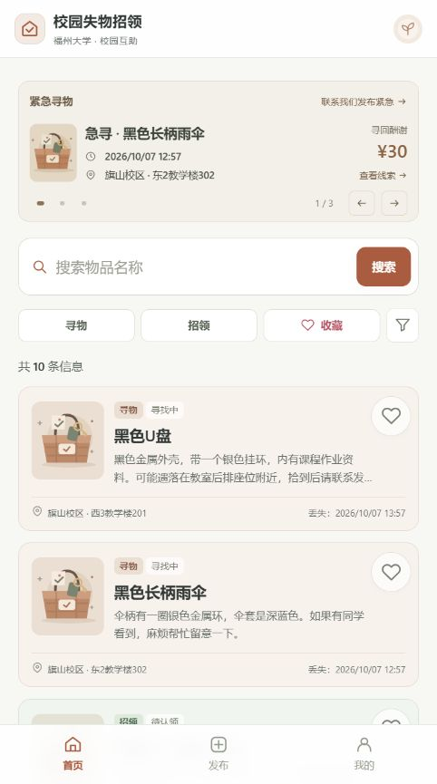
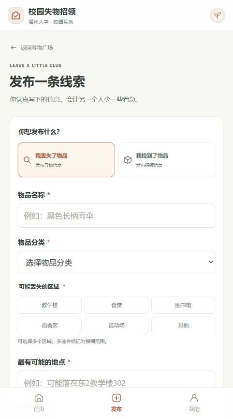
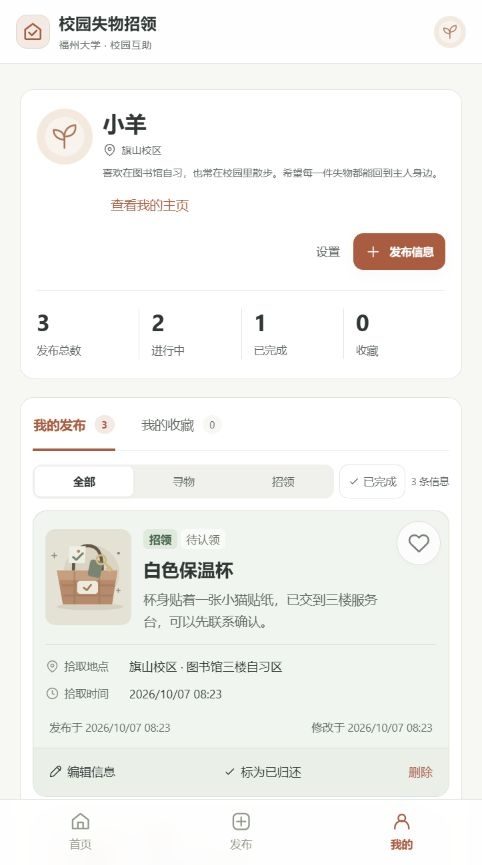
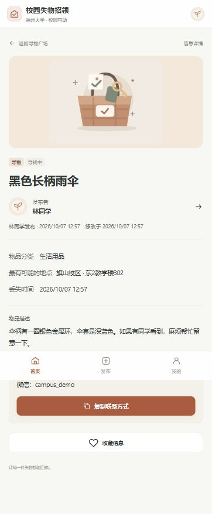
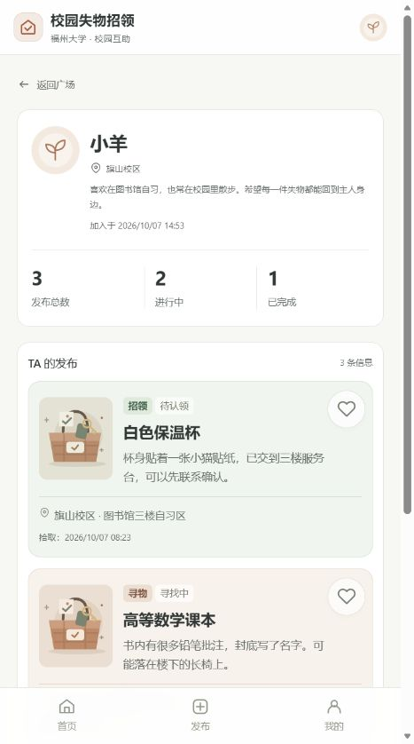
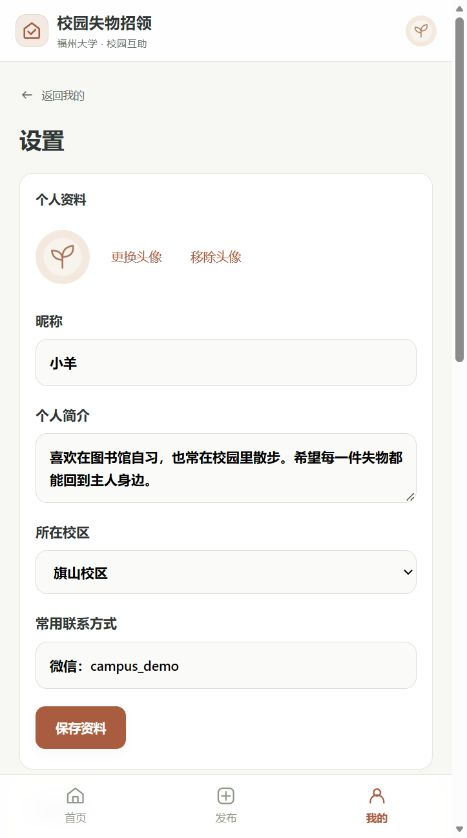

# 2026秋软件工程结对作业（第二次）：校园失物招领程序实现

| 项目 | 内容 |
| --- | --- |
| 课程 | [H202601软件工程与软件工程实践](https://edu.cnblogs.com/campus/fzu/2026-01SoftwareEngineeringandSoftwareEngineeringPractice) |
| 作业要求 | [2026秋软件工程结对作业（第二次）](https://edu.cnblogs.com/campus/fzu/2026-01SoftwareEngineeringandSoftwareEngineeringPractice/homework/16745) |
| 作业目标 | 根据上次的需求和原型，做出可以实际操作的校园失物招领程序，并完成测试 |
| 结对成员 | 王智洋（102402136）、庄剑钇（102402152） |
| 队友博客 | [庄剑钇的博客](https://www.cnblogs.com/always111/) |
| 本篇博客地址 | 【发布后填写本篇地址】 |
| GitHub项目 | [102402136-102402152](https://github.com/MieSheeeep/102402136-102402152) |
| 上次需求与原型 | [校园失物招领：需求分析与原型设计](https://www.cnblogs.com/MieSheeeep/p/23138166) |

## 一、这次做了什么

上次作业画出了页面和操作流程，这次把它做成了网页。我们先做发布、浏览、搜索、查看详情和修改状态，再补筛选、收藏、个人主页等功能。

比如，一位同学丢了雨伞，可以发布名称、丢失时间、可能丢失的地方和联系方式。另一位同学在首页搜索“雨伞”，打开详情后联系发布者。确认找回以后，由发布者到“我的发布”标记“已找到”。如果是捡到物品，归还后标记“已归还”。其他人重新加载列表或打开详情时，也能看到更新后的状态。

这次实现的是网页。上次原型使用小程序的页面形式，因此保留了“首页、发布、我的”三个入口。当前没有实现原生微信小程序，也没有做站内聊天、地图定位或学校实名认证。联系双方需要根据详情中的联系方式，在应用外沟通。

开发中使用了AI辅助编写代码、整理测试和排查样式问题。下面的功能、代码和测试结果均对应实际项目；两人的协作过程和耗时按真实记录填写。

## 二、两人分工与PSP

### 1. 实际分工

【待补：填写本次实际完成的工作。上次原型阶段的分工不能直接当作本次开发分工。】

| 成员 | 本次负责的具体工作 | 协作记录 |
| --- | --- | --- |
| 王智洋 | 【填写实际负责的页面、代码、测试或文档】 | 【填写对应提交、讨论或互审记录】 |
| 庄剑钇 | 【填写实际负责的页面、代码、测试或文档】 | 【填写fork、PR及互审记录】 |

### 2. PSP记录

单位为分钟。分类标题不重复计入合计，下面的预估和实际耗时需要根据两人的记录补齐。

| PSP2.1 | 任务 | 预估耗时 | 实际耗时 |
| --- | --- | ---: | ---: |
| Planning | 计划 | — | — |
| Estimate | 估计这次任务需要多少时间 | 待补 | 待补 |
| Development | 开发 | — | — |
| Analysis | 需求分析，包括学习新技术 | 待补 | 待补 |
| Design Spec | 编写设计文档 | 待补 | 待补 |
| Design Review | 设计复审 | 待补 | 待补 |
| Coding Standard | 确定代码规范 | 待补 | 待补 |
| Design | 具体设计 | 待补 | 待补 |
| Coding | 编码 | 待补 | 待补 |
| Code Review | 代码复审 | 待补 | 待补 |
| Test | 测试、修改和提交 | 待补 | 待补 |
| Reporting | 报告 | — | — |
| Test Report | 测试报告 | 待补 | 待补 |
| Size Measurement | 计算工作量 | 待补 | 待补 |
| Postmortem & Process Improvement Plan | 总结并提出改进办法 | 待补 | 待补 |
| 合计 | 以上具体任务之和 | 待补 | 待补 |

【待补：哪一项比预估花得久，差了多少，为什么。可以结合筛选交互、图片上传或底栏问题，写实际发生的返工，不要只写“时间安排不合理”。】

## 三、实现过程

### 1. 从原型到页面

我们保留了原型里的主要页面，把它们接成可以操作的流程。首页负责集中展示和搜索；发布页负责收集信息；详情页负责展示完整内容和联系方式；“我的”负责管理本人发布及收藏。

实际做出来以后，页面又经过了几轮调整。首页最初提示文字较多，公告和卡片也偏大，后来缩短了卡片，把外露的筛选收为“寻物、招领、收藏”，其余放进漏斗按钮。丢失和拾取的时间放在卡片上，发布时间放在详情和“我的发布”里。这样找东西时先看到的是事情发生的时间。

界面采用暖棕色表示寻物、浅绿色表示招领，已完成的信息用灰蓝色区分，同时保留文字状态。底部导航在各个页面都可以使用。收藏、弹窗和按钮增加了点击反馈，减少操作后没有反应的感觉。





### 2. 核心流程


发布时检查名称、分类、地点、事件时间和联系方式。必填内容只输入空格也不能提交。描述和照片可以不填。搜索没有结果时显示空结果提示，不生成假的匹配信息。

找回或归还后，发布者可以在“我的发布”中更新状态，操作前有确认弹窗。误点完成后还能取消，取消也需要确认。更新状态保留原来的内容和发布时间，只修改状态及修改时间。首页、详情和个人发布列表使用同一套状态规则。



### 3. 数据怎样保存

前端使用HTML、CSS和JavaScript，后端使用Fastify，数据保存到SQLite，图片保存为本地文件。页面渲染、业务规则和接口访问分开写，修改界面时不需要把数据库操作也塞进页面代码。


项目有两种运行方式：

- 用Chrome直接打开`index.html`：体验核心流程，信息和收藏保存在当前浏览器的`localStorage`中，使用固定的本地用户。
- 启动本地后端：网页通过API读写SQLite，支持注册登录、多账号、图片上传和公开个人主页。数据库和图片在重启后保留。

两种方式的数据分开保存。直接打开HTML时的数据不会自动导入数据库。首次启动后端会写入七条物品信息、三条公告和演示账号，方便打开后就能查看和操作；已有数据不会在每次重启时重新覆盖。

### 4. 一段关键代码：谁能更新状态

下面是`server/app.cjs`中更新接口的节选：

```javascript
const user = auth(req);
const old = getItem(req.params.id, user);
const body = req.body || {};
if (old.ownerId !== user.id) fail(403, '只能管理本人发布的信息');
if (body.version !== old.version) fail(409, '信息已被修改，请刷新后重试');
let item;
if (body.status !== undefined) {
  if (!['open', 'completed'].includes(body.status)) fail(400, '状态不正确');
  item = (body.status === 'completed' ? D.completeItem : D.reopenItem)
    ([old], old.id, user.id)[0];
}
```

第一步从登录信息确定用户，再检查这条发布属于谁。因此，其他人即使直接调用接口，也不能修改别人的信息。`version`用于检查页面中的信息是否已经过时，避免旧页面覆盖新的修改。最后根据请求选择完成或取消完成，写入数据库后返回更新的记录。

`js/data.js`负责把内部状态翻译成界面文字：寻物完成显示“已找到”，招领完成显示“已归还”。这使不同页面不必各自猜状态。

## 四、增加了哪些方便使用的功能

### 1. 地点、分类多选和时间范围

只按物品名称搜索，结果多时仍然不好找。现在可以展开漏斗按钮，选择多个地点和分类，再限定丢失或拾取日期。面板内部可滚动，点击应用后保持展开，方便继续调整。

同组的条件取“或者”，不同组的条件取“并且”。比如选“教学楼、食堂”和“生活用品、电子设备”，结果必须在所选地点之一，同时属于所选分类之一。都不选表示不限制。日期筛选包含起止两天，依据事件发生时间筛选。

下面是筛选函数中的对应条件节选：

```javascript
(!filters.categories?.length || filters.categories.includes(item.category)) &&
(!filters.locations?.length ||
  itemAreas(item).some(area => filters.locations.includes(area))) &&
(!range || (item.timePrecision !== 'unknown' && Boolean(item.occurredAt) &&
  item.occurredAt.slice(0, 10) >= range[0] &&
  item.occurredAt.slice(0, 10) <= range[1]))
```

寻物发布也支持选择多个可能区域，并明确显示“模糊范围”。补充地点写成“最有可能的地点”，避免把不确定的地点说成确定地点。招领仍填写实际拾取区域。时间可以填具体时刻，也可以只填大致日期。

### 2. 收藏和复制联系方式

暂时不确定是不是自己的物品时，可以先收藏，再从“我的收藏”回来查看。收藏按钮有颜色和点击反馈。详情提供复制联系方式的入口，减少来回输入；浏览器不允许自动复制时，可以手动复制。

收藏只保存物品编号，避免把整条信息复制一份后变成旧数据。删除发布时，后端会一起清理对应的收藏关系。



### 3. 发布者主页和个人设置

详情里的发布者可以打开公开主页，查看简介、校区、发布总数、进行中及已完成数量。这些数据从该用户的发布计算，完成或取消完成后会更新。统计只能作为了解发布记录的参考。

设置中可以修改昵称、头像、简介和校区。校区用福州大学校区选项，减少同一个校区被写成不同名称的情况。常用联系方式只在本人设置中保存，新发布时可以带入；公开主页不展示这项个人设置。





紧急公告展示物品、丢失时间、地点和酬谢金额，支持切换公告并进入对应详情。当前配图及初始内容用于演示，尚未作为真实校园服务运营。

## 五、目录和运行方法

### 1. 主要目录

```text
index.html                 页面入口、主导航和弹窗容器
css/styles.css             页面样式、动效和适配
assets/                    默认配图和头像
js/seed.js                 静态体验的初始数据
js/data.js                 校验、筛选、收藏和状态规则
js/views.js                页面渲染与文字转义
js/app.js                  导航、表单和交互
js/api.js                  后端接口访问
js/feedback.js             点击反馈
server/                    API、数据库、图片与演示数据初始化
tests/                     单元测试和接口测试
e2e/                       Chrome页面流程测试
docs/                      原型记录、设计及测试说明
var/                       运行后生成的数据库与图片，不提交Git
package.json               依赖和运行命令
README.md                  使用说明
```

### 2. 最方便的体验方式

从GitHub下载完整项目并解压，保留文件夹结构，用Chrome打开根目录的`index.html`。无需安装依赖，可体验发布、浏览、搜索、详情、收藏、编辑和完成状态。刷新后可以检查刚才的数据是否保留。

### 3. 体验账号、数据库和图片上传

安装Node.js 24.19及以上的24.x版本，在项目目录执行：

```powershell
npm.cmd ci
npm.cmd start
```

用Chrome访问终端打印的`http://127.0.0.1:3000`。可自行注册，也可使用账号`demo_student`、密码`CampusDemo123!`，体验三条已有发布和两条收藏。演示账号中的联系方式用于展示页面。

数据库位于`var/campus.sqlite`，图片位于`var/uploads/`。结束程序后，下次运行同样的命令即可继续使用。当前在本地运行，没有公网部署。

建议验收时走一遍：发布一条信息→首页按名称搜索→打开详情→查看联系方式→“我的发布”标记完成→回首页确认状态→取消完成。再试一次必填项为空和搜索无结果。

## 六、测试

### 1. 工具和简单用法

测试使用Mocha，断言使用Node自带的`node:assert/strict`。Mocha负责组织和运行测试，断言负责比较实际结果与预期结果。入门可参考[Mocha官方文档](https://mochajs.org/)。

在已有项目中先执行`npm.cmd ci`安装依赖，再执行`npm.cmd test`。`describe`把相关测试放在一组，`it`写一个具体用例。遇到异步接口测试时使用`async/await`，让测试等到请求结束再判断结果。

下面是项目中的收藏测试：

```javascript
const { describe, it } = require('mocha');
const assert = require('node:assert/strict');
const D = require('../js/data.js');

describe('收藏', () => {
  it('favorite toggle adds once then removes', () => {
    const a = D.toggleFavorite([], 'one');
    assert.deepEqual(a, ['one']);
    assert.deepEqual(D.toggleFavorite(a, 'one'), []);
  });
});
```

第一次调用时编号不存在，应该加入；第二次已经存在，应该移除。它检查了收藏函数的两个分支。断言失败时，Mocha会指出失败用例并显示结果差异。需要单独排查收藏时，可执行`npm.cmd test -- --grep "favorite"`。

### 2. 保留的十项单元测试

按老师附录至少十项的要求，业务与视图部分保留了十项单元测试。另有九项接口及演示数据测试、七项Chrome页面测试，总共二十六项。

| 单元测试 | 构造的数据 | 检查的结果与分支 |
| --- | --- | --- |
| 完整表单 | 合法名称、分类、地点、时间和联系方式 | 不产生字段错误 |
| 必填项无效 | 名称全为空格、联系方式为换行、地点为空 | 拒绝提交并指出字段 |
| 创建信息 | 名称前后带空格 | 去掉多余空格，生成编号，初始状态为进行中 |
| 名称搜索 | 名称含AirPods，关键词为` airpods ` | 忽略首尾空格及大小写，找到记录 |
| 收藏切换 | 从空数组开始，连续点击同一编号 | 加入与移除两个分支正确 |
| 取消完成 | 分别构造已完成的寻物和招领 | 恢复进行中，保留内容和发布时间；保存后仍能读取 |
| 多选筛选 | 四条不同地点、分类的记录 | 组内取并集，组间取交集；空选择不限制 |
| 事件日期范围 | 起始日、结束日23:59、范围外日期、旧数据无事件时间 | 包含两端、排除范围外及无法匹配时间的记录；不按发布时间误筛 |
| 用户文本转义 | 名称、描述等填写带事件属性的HTML文字 | 显示为文字，不产生注入元素 |
| 表单属性转义 | 名称带引号和`onfocus`文字 | 不能突破输入框的属性边界 |

这部分采用白盒思路：看过函数中的条件后，分别构造正常、错误和边界数据。多选筛选检查有选项和无选项的分支；日期检查起止边界；状态同时检查寻物与招领；转义检查文字节点和属性两种位置。没有把“所有测试通过”写成“所有分支都已覆盖”，目前未做代码覆盖率统计。

### 3. 接口和页面测试

接口测试用独立的临时数据库创建两个账号，检查重复注册、错误密码、不能修改他人发布、收藏互不影响、旧版本修改被拒绝、图片归属、重启后数据保留及删除后的收藏清理。这样的数据可以重复构造，也不会修改平时的演示库。

Chrome页面测试通过Playwright操作真实网页，走注册、带图片发布、另一账号查看与收藏、修改资料、完成和取消完成、编辑及删除等流程。还检查390px和1200px宽度下的底部导航与横向溢出。

比较容易漏的是“取消完成”的弹窗流程：点击确认后，测试要等待弹窗关闭，再操作下一项。另外，图片上传要检查真正的图片内容，不能只看文件名是否以`.png`结尾。

运行命令：

```powershell
npm.cmd test
npm.cmd run test:browser
npm.cmd run check
```

2026年10月7日重新运行的结果为：

```text
npm test              19 passing
npm run test:browser   7 passing
npm run check         语法检查通过
```

测试代码见仓库中的[tests目录](https://github.com/MieSheeeep/102402136-102402152/tree/main/tests)和[e2e目录](https://github.com/MieSheeeep/102402136-102402152/tree/main/e2e)。自动测试之外，还需要在Chrome直接打开HTML，人工核对布局、空结果、表单错误及复制联系方式。现有测试没有证明实际用户能更快找回物品，这一点需要后续真实使用反馈。

## 七、Git提交记录

仓库按功能和修复逐步提交，包括MVP、筛选和收藏动效、本地后端、图片上传、底栏修复及测试整理。可以从[提交历史](https://github.com/MieSheeeep/102402136-102402152/commits/main/)查看每次改动。


【待补：队友fork和实际PR链接，以及双方互审的改动。单个账号的提交记录不能代替两人的结对记录。】

## 八、遇到的问题：发布页的底部导航为什么消失

图片上传区域调整后，进入发布页时底部导航看起来不见了。最开始从定位入手，试着根据可视区域调整底栏位置，但没有解决根因，反而出现底栏位置变化。

后来检查了页面实际宽度，发现一个隐藏的文件输入框被普通表单的`width: 100%`样式覆盖。控件虽然看不见，却把页面撑宽了。浏览器因此重新计算视口，底栏也跟着跑出可见范围。

最后保留底栏的固定定位，为上传区域增加相对定位，并明确限制隐藏控件的尺寸。修复代码节选：

```css
.item-image-editor { position: relative; }
.form-field input.sr-only {
  position: absolute;
  width: 1px;
  height: 1px;
  max-width: 1px;
  min-width: 0;
  padding: 0;
  overflow: hidden;
}
```

测试也跟着修改：横向溢出比较页面的`scrollWidth`和`documentElement.clientWidth`。原先比较`innerWidth`，它也可能随页面撑宽，导致测试漏报。随后把发布页纳入手机宽度检查。

这个问题让我们认识到，看起来是底栏的问题，也可能由页面里一个看不见的控件引起。以后先测量布局，再改定位；发现一个漏测场景，就把它补进测试。

## 九、回顾和队友评价

程序已经能走完“发布—浏览或搜索—详情—联系—更新状态”。这次反复修改的地方主要是信息摆放、筛选交互、图片和底部导航。原型能点通以后，实际页面仍需要用真实输入、不同屏幕宽度和错误情况检查。

下一步更需要让同学拿实际场景试用，看看名称、地点和时间是否够用，以及找到以后是否容易发现状态更新入口，再决定继续加什么功能。

【待补：结合真实合作，写队友做得好的一个具体例子，以及下一次希望改进的一点。】

【待补：两人各自最有感触的一件事，例如一次讨论如何改变实现，或一个测试怎样发现问题。】
