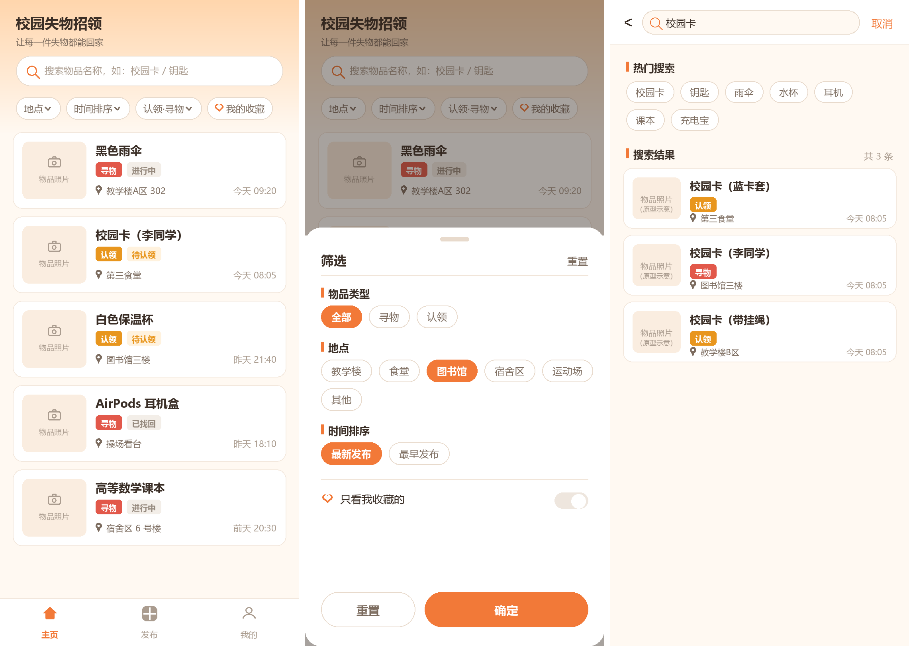
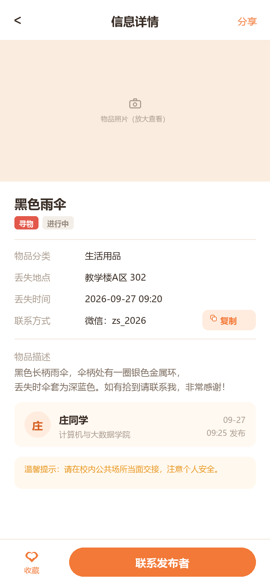
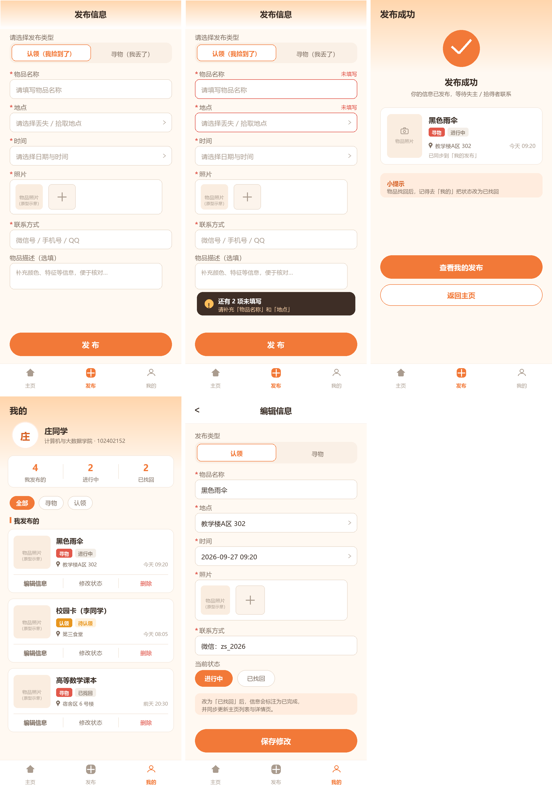
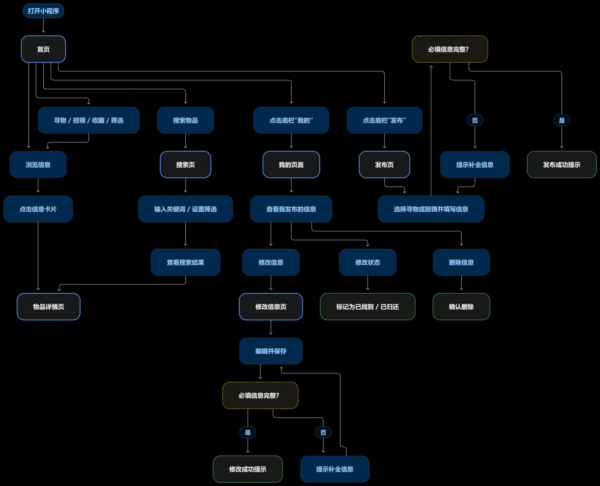
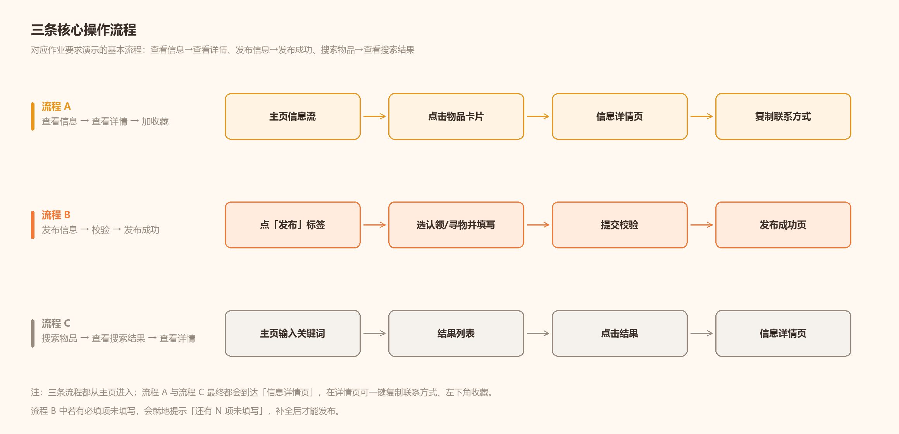

# 上次作业博客原文提取

来源：https://www.cnblogs.com/MieSheeeep/p/23138166

提取日期：2026-10-06（北京时间）。以下保留正文内容和原有用词，图片改为本地相对路径；未改写原文中的文字错误。此记录不是本次实现规格。

---

# 校园失物招领小程序：需求分析与原型设计

| 项目 | 内容 |
| --- | --- |
| 这个作业属于哪个课程 | [H202601软件工程与软件工程实践](https://edu.cnblogs.com/campus/fzu/2026-01SoftwareEngineeringandSoftwareEngineeringPractice) |
| 这个作业的要求在哪里 | [2026秋软件工程个人作业(第三次)](https://edu.cnblogs.com/campus/fzu/2026-01SoftwareEngineeringandSoftwareEngineeringPractice/homework/16742) |
| 这个作业的目标 | 完成「校园失物招领小程序」的需求分析和原型设计 |
| 原型设计链接（墨刀） | [小程序链接](https://modao.cc/ai/share/6ab92e5975d0275ef6ff30c9?pvp=mobile) |
| 结对成员 | 102402152（庄剑钇）、102402136（王智洋） |

## 一、作业之前

本次作业要求结对完成需求分析与原型设计，不涉及程序实现。开始设计前，我们阅读了《构建之法》第 3 章和第 8 章的相关内容，并先讨论两人如何分工、用户要完成哪些操作，再决定原型需要哪些页面。考虑到后续结对编程还将依据本次原型开展，我们把功能简单、流程清楚作为设计依据。

## 二、需求分析

校园里的寻物和招领信息通常发在班级群、宿舍群或朋友圈。比如同学在教学楼捡到一张校园卡，消息可能只传到自己所在的群；失主不在群里，即使双方都发了消息，也很难发现彼此。群聊信息还会被新消息覆盖，事后查找不方便。小程序要解决的就是信息分散、难以搜索的问题，让同学们可以集中发布和查看信息。

主要用户是失主和拾得者。前者需要发布寻物信息或搜索招领信息，后者需要发布招领信息或查看是否有人在寻找；其他同学也可以浏览并转告相关信息。本版保留浏览、发布、搜索、查看详情和修改状态等基本功能。用户通过详情页提供的联系方式取得联系；实名认证、即时聊天、地图定位和复杂后台不在本次设计范围内。

## 三、主要功能与原型设计

我们使用**墨刀**制作可点击的手机端原型，在线地址见文首。底部设置“首页／发布／我的”三个入口，搜索页和详情页由首页进入。首页展示最近发布的寻物、招领信息，每张卡片显示物品名称、图片、地点、时间和状态；顶部搜索入口通向搜索页，用户输入关键词后查看结果，也可以按地点、时间、类型等条件筛选。

点击卡片进入详情页后，用户可查看物品描述、图片和联系方式，也可复制联系方式或收藏该条信息。例如看到“招领校园卡”，失主可以先核对拾取地点和时间，再联系发布者确认物品特征。招领照片不应露出完整卡号等个人信息。

发布页先选择“寻物”或“招领”，再填写物品名称、时间、地点、描述及联系方式，可上传图片。两种类型共用表单，时间和地点的提示文字分别对应“丢失”或“拾取”。必填项缺失时页面给出提示，提交成功后显示反馈。发布者还可以在“我的”查看和编辑信息，并在物品找回后修改状态。

## 四、用户使用流程

总体业务流程从首页开始。用户可浏览信息流，也可通过关键词和筛选条件查找物品；找到相关信息后进入详情页，核对时间、地点和物品特征，再复制联系方式与发布者沟通。若没有合适结果，可调整条件继续查找。物品确认归还后，发布者在“我的”中将状态改为“已找回”，完成信息闭环。

核心操作流程分为查看、发布和搜索三条路径。查看与搜索最终都进入详情页；发布时先选择寻物或招领类型，再填写相关信息。系统提交前检查必填项，缺失时提示补充，信息完整后发布成功。

## 五、结对过程与 PSP 记录

我们主要是在线下进行讨论交流的。首先我们阅读学习了《构建之法》。随后各自阅读题目（不受对方影响），各自现有一些思路后，再进行讨论。考虑实际应用场景下，应该具备哪些功能，具体应该是什么样的形式。除了这些基础功能外，我们还讨论到用户需要的便利操作或者操作反馈功能能。例如筛选收藏，一键收藏，一键复制，在发布/修改时给予反馈。讨论完成后，我们一人负责原型的设计，一人完成文档的撰写以及流程图的绘制。并每隔一段时间进行友好互动（互审），对其原型设计和文档的颗粒度。

下表记录各阶段的预估耗时和实际耗时，单位为分钟。

| 阶段 | 预估 | 实际 |
| --- | --- | --- |
| 阅读教材 | 60 | 60 |
| 阅读题目与需求分析 | 40 | 60 |
| 草图与页面结构 | 40 | 100 |
| 原型初稿 | 90 | 120 |
| 原型修改 | 60 | 110 |
| 流程图 | 30 | 45 |
| 博客以及图片整理 | 60 | 80 |
| 结对检查 | 40 | 40 |
| **合计** | **420** | **615** |

## 六、个人总结

### 个人总结

本次作业过程中，我主要负责讨论用户需求分析，功能梳理与确定，文档撰写以及流程图的绘制。队友主要负责原型的制作。

前期学习中，我开始对原型设计和开发之间的关系有一点理解：原型设计相当于为接下来的开发定下了可视化的稿子，把应用实现哪些具体功能，用户的交互逻辑定的更明白，也就是传统的原型设计更偏向于给用户需求，产品定位这一块，而和真正的代码开发关系不是那么大。也了解到一些新的开发方式其实也是将原型和UI开发结合，使得代码复用性更强一些。

在实践过程中，我了解了原型设计具体是做什么以及为何如此重要。口头的描述讨论，与形成的文档本就有差异了，文档和真正的软件界面设计，更具差别。而在原型设计的过程中，其可视化的表达力，让我们更能梳理好对于用户需要具备的功能，约束我们的实现。这种梳理可以是具体性的，例如我们说我们需要一个搜索功能，我们当时并不会考虑说它究竟应该放在哪个位置，是否应该具有历史搜索，是否应该让搜索后跳转到新的页面，但是这些东西在原型设计中就被确定下来，也就是对于用户对于搜索功能的需求对应的我们提供的搜索功能的操作流程，更加具体了；这种梳理也可以是优化性的，例如我们原本决定将收藏体现在个人页中，是在设计的过程中意识到，一件筛选收藏的功能放在主页会是一个更直观的选择，所以我们将收藏转移到了首页的筛查中；还能是开放添加新的等等等。总而言之，原型设计可以说是开发可视化设计必不可少的一环，由它定下了用户的最终交互逻辑。

作业中出现的一个比较明显的问题是我们前期讨论得太久，而没有尽快去进入实际原型设计的实践。这导致我们原本在讨论过程中产生的一些设计、美化理念，最终并没有成功落实到原型设计中，有些是讨论后再草稿上被遗忘，有些是缺少时间去完善。而且有一些东西，即使讨论清楚了在落地到设计的过程中才发现是不可行的，例如筛选中的一些东西并不好实现。所以软件设计不能长期停留在脑中的讨论阶段，需要尽早通过流程图、原型等可视化形式验证想法，再根据实际页面继续修改。特别是对于团队人数少的小项目，第一步应该是尽快把可视化的东西构建出来，而不是不断只在讨论中积累想法，在文档里添加内容，构建出基本的框架之后大家的思路才反而更能打开思路
