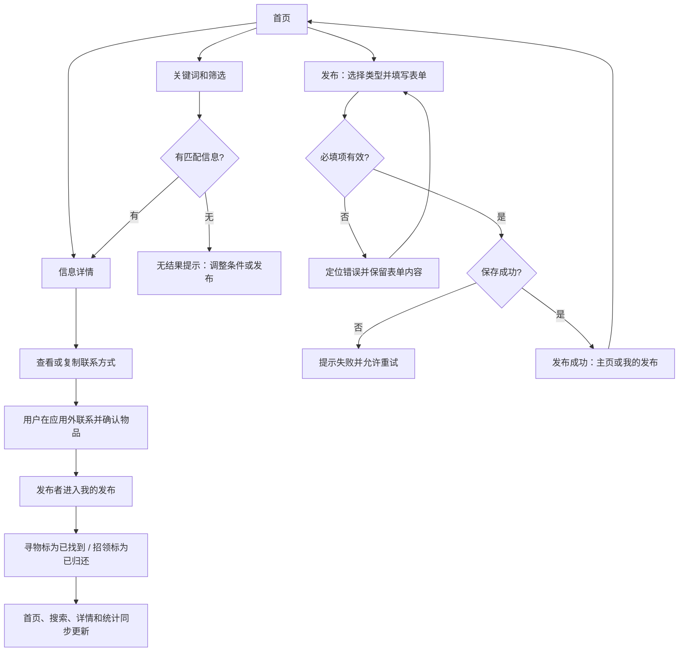

# 校园失物招领：需求提取与第一版设计草案

日期：2026-10-06（北京时间）
状态：用户已选择先做本地 MVP；第一版采用原生 HTML / CSS / JavaScript 和浏览器本地存储。
成员：王智洋（102402136）、庄剑钇（102402152）。

## 1. 文档依据与使用方式

本文件将上次博客的文字和截图整理为可用于开发的需求，并提出第一版实现建议。博客中的既有设计、用户本次确认的变化、本文补充的建议分别标注，避免把建议当成已确定需求。

- [上次博客](https://www.cnblogs.com/MieSheeeep/p/23138166)：需求分析与原型设计。
- [博客原文提取](../../references/blog-extract.md)：保留原文和全部五张配图。
- [墨刀分享链接](https://modao.cc/ai/share/6ab92e5975d0275ef6ff30c9?pvp=mobile)：暂未成功直接查看其在线交互。
- [本次程序实现作业](https://edu.cnblogs.com/campus/fzu/2026-01SoftwareEngineeringandSoftwareEngineeringPractice/homework/16745)：上一轮已通过用户打开的作业页读取。

本文已经看过博客中的首页／筛选／搜索、详情、发布／我的／编辑截图。页面跳转、点击区域、动态反馈是否在墨刀中真实工作，尚未验证。后面的业务流程由博客文字和截图整理，不代表墨刀交互测试结果。

## 2. 问题、目标和用户

**博客已有：**校园失物信息散落在群聊、朋友圈，覆盖范围有限，容易被新消息淹没。产品提供集中发布与查找的入口，帮助失主与拾得者取得联系，并在找回或归还后结束信息。

| 用户角色 | 主要任务 |
| --- | --- |
| 失主 | 发布寻物信息，搜索招领信息，核对物品特征并联系发布者 |
| 拾得者 | 发布招领信息，查看相关寻物信息，物品归还后更新状态 |
| 其他同学 | 浏览信息，并把相关线索转告失主或拾得者 |
| 信息发布者 | 在“我的”中管理本人发布的信息 |

失主和拾得者是使用场景中的角色，不需要设计成两套独立账号。

第一版成功标准是：用户能够完成“发布信息 → 浏览或搜索 → 查看详情 → 获取联系方式 → 发布者更新状态”的完整流程。本文不承诺缩短寻物时间等未经用户验证的效果。

## 3. 范围与已确认变化

**博客已有：**浏览、发布、搜索、详情、信息编辑、状态维护；便利功能包含筛选、收藏、复制联系方式和操作反馈。实名认证、即时聊天、地图定位、复杂后台不在原设计范围内。

**用户本次已确认：**允许先使用一张默认图片代替物品照片。因此第一版图片上传可推迟，发布信息不因未上传照片而失败。原型中“照片”为必填的星号需要同步移除。

**本文建议的实现顺序：**先完成业务闭环，再补收藏、筛选和视觉细节。热门搜索、个人资料展示、分享按钮、图片放大属于原型中出现的内容，优先级低于核心流程，不能以静态装饰冒充已实现功能。

## 4. 页面与交互提取

### 4.1 首页

**博客文字和截图已有：**

- 标题为“校园失物招领”，副标题为“让每一件失物都能回家”。
- 顶部搜索框，提示按物品名称搜索。
- 地点、时间排序、寻物／认领类型及“我的收藏”入口。
- 信息卡片展示图片、名称、类型、状态、地点、时间。
- 底部导航为“首页／发布／我的”。

**本文建议：**默认按发布时间从新到旧展示；卡片区分事件发生时间与发布时间。已结束的信息仍可查看，并明确展示完成状态，减少重复联系。

### 4.2 筛选面板与搜索页

**截图已有：**筛选以底部面板呈现，可选全部／寻物／认领、教学楼／食堂／图书馆／宿舍区／运动场／其他、最新／最早发布，以及只看收藏；提供重置和确定。搜索页有热门词、结果数量和结果卡片。

**本文建议：**关键词按物品名称匹配，去除首尾空格；关键词、地点、类型、收藏条件联合生效。空关键词恢复全部匹配项，无结果时提示清除条件或发布信息。时间排序按发布时间执行，不把物品丢失时间当成发布时间。

### 4.3 信息详情

**截图已有：**物品图片、名称、类型、状态、物品分类、地点、事件时间、联系方式、描述、发布者信息、发布时间、收藏、联系发布者及分享入口。

**本文建议：**“复制联系方式”和“联系发布者”统一用于展示／复制用户填写的联系方式，不假设已接入微信或站内聊天。复制失败时保留可选中的文本并提示手动复制。个人资料仅使用明确标注的示例信息。第一版不额外收集学号和学院。

### 4.4 发布信息与发布成功

**文字和截图已有：**寻物和招领共用表单；名称、地点、时间、联系方式为必填。描述在截图中为选填。缺失字段显示红框和提示，提交成功后提供“查看我的发布”和“返回主页”。

**本文建议：**增加物品分类选择，使详情中的分类有真实数据来源。名称、地点、联系方式去除首尾空白后校验；校验失败保留已输入内容。联系方式允许微信、QQ、电话或其他文字，不强制按手机号格式校验。避免用户连续点击产生重复记录。数据保存失败时不得显示发布成功。

### 4.5 我的与编辑

**截图已有：**个人信息区域、发布总数／进行中／已找回统计、按类型筛选、本人发布的卡片，卡片提供编辑、修改状态、删除。编辑页回填已有字段并能保存状态。

**本文建议：**只展示当前用户本人发布的记录；统计中的“已找回”统一改为“已完成”，同时包含已找到和已归还。删除前确认，删除后同步更新列表、收藏和统计。编辑采用与发布相同的校验规则；编辑成功不改变原发布时间。

## 5. 命名与状态规则

原文和截图存在三处不一致，以下为本文建议，待确认后用于界面和代码：

| 不一致 | 建议统一方式 |
| --- | --- |
| 博客写“招领”，截图写“认领” | 发布类型统一称“寻物／招领”；“认领”作为失主取回物品的动作 |
| 截图选择“认领”时示例卡片却显示“寻物” | 保存时以实际选择类型为准，成功页读取保存后的记录 |
| 博客／截图统一写“已找回”，本次作业区分状态 | 寻物：进行中 → 已找到；招领：待认领 → 已归还 |

内部状态建议使用“未完成／已完成”两个值，显示文案由信息类型决定。收藏与状态无关，完成信息也可保留收藏。

第一版建议类型发布后不可修改，避免改变信息含义和状态文案；其他内容可编辑。第一版完成后不提供重新打开入口，若误操作可在后续迭代补充。

## 6. 关键业务流程

以下为根据博客提取后补齐的流程，原流程图见原文附件。

“联系发布者”与“完成状态”是两次不同的动作：获取联系方式不自动结束信息，状态由发布者在确认找回／归还后修改。

## 7. 数据与归属建议

以下是实现建议，不是博客规定的技术架构。

| 字段 | 含义 | 规则 |
| --- | --- | --- |
| id | 信息唯一标识 | 创建时生成，编辑不改变 |
| ownerId | 发布者标识 | 用于我的发布和操作权限判断 |
| type | 寻物／招领 | 发布必选 |
| name | 物品名称 | 必填 |
| category | 物品分类 | 建议必选；至少包含其他 |
| locationGroup | 地点分组 | 供地点筛选使用 |
| locationDetail | 具体地点 | 必填，可描述楼层、教室等 |
| occurredAt | 丢失／拾取时间 | 必填，有效日期时间 |
| contact | 联系方式 | 必填文字 |
| description | 物品特征描述 | 选填 |
| image | 默认物品图片 | 首版共用一张 |
| status | 未完成／已完成 | 新发布默认未完成 |
| createdAt / updatedAt | 发布／更新时间 | 系统记录 |

收藏单独保存为当前用户的记录 ID 集合，不改写信息的公共内容。

必须区分两种产品目标：

- **本地演示：**数据保存在当前浏览器，用固定演示用户维护“我的发布”；预置其他人的示例记录。其他电脑看不到本机发布的信息，浏览器身份也不构成真实账号鉴权。
- **联网使用：**不同用户共享信息，需服务端存储和身份识别，并校验发布者权限；需要部署与额外开发工作。

博客未规定采用哪种方式。用户本轮已选择先不实现后端，第一版采用本地浏览器演示；联网方案仅保留为未来选项。

## 8. 技术与视觉方向供讨论

| 方案 | 优点 | 代价／适用条件 |
| --- | --- | --- |
| 原生 HTML / CSS / JavaScript | 容易交付直接打开的静态页面；当前功能规模可控 | 需要自行管理页面渲染和状态 |
| React + 本地开发与构建 | 组件复用、表单与状态管理方便 | 必须明确交付后的启动方式，普通模块构建产物不能假定双击即可运行 |
| React + 服务端存储 | 可形成多人共享的完整产品 | 需要账号、接口、部署和维护；开发范围更大 |

本文建议：若目标为本地作业演示，先采用原生方案；若用户明确选择 React，可将相同需求转成组件实现，并验证交付方式。界面质量不由框架决定。

视觉建议保留原型的暖橙色品牌方向，改善文字层级、卡片密度、间距、按钮与状态的对比度。手机保留三个底部入口，电脑采用适合宽屏的导航和列表布局。所有页面共用字体、颜色、圆角和按钮规范。第一版使用同一张默认物品图，靠名称、类型、状态和地点区分信息。

第一版已按这个方向实现网页，未制作独立 Figma 稿。搜索结果合并在首页展示，详情使用独立路由；筛选使用工具栏，不单独制作原型中的底部筛选面板。

## 9. 验收与测试设计

本节是验收目标清单。第一版已完成 30 个自动测试及部分浏览器走查，具体完成范围见 [MVP 验证记录](../../mvp-verification.md)。本次作业正文写至少 5 个测试用例，附录写至少 10 个，因此按不少于 10 个准备，并覆盖业务分支。

| 编号 | 场景 | 预期结果 |
| --- | --- | --- |
| 01 | 发布一条完整寻物信息 | 首页和我的发布出现新记录，初始状态正确 |
| 02 | 发布一条完整招领信息 | 时间／地点文案对应拾取，状态为待认领 |
| 03 | 必填字段为空或只有空格 | 阻止保存，提示对应字段，保留其他输入 |
| 04 | 无效时间 | 阻止保存，提示修正时间 |
| 05 | 关键词前后带空格 | 按去除首尾空格后的关键词搜索 |
| 06 | 关键词和地点／类型组合 | 结果同时满足所有条件 |
| 07 | 搜索无匹配结果 | 显示无结果提示，可清除条件 |
| 08 | 切换时间排序 | 按发布时间正确排序 |
| 09 | 收藏、取消收藏、只看收藏 | 详情和列表保持一致 |
| 10 | 编辑本人记录 | 修改生效，原发布时间不变 |
| 11 | 修改两种信息的完成状态 | 寻物显示已找到，招领显示已归还，各页面同步 |
| 12 | 尝试管理他人记录 | 不提供操作入口；数据层也拒绝操作 |
| 13 | 复制联系方式失败 | 不误报成功，用户仍能手动复制 |
| 14 | 数据保存失败或已保存内容损坏 | 明确反馈，避免静默丢失或假成功 |
| 15 | 刷新与重新打开 | 按选定保存方式恢复数据和收藏 |
| 16 | 手机和电脑操作完整流程 | 内容可读，关键操作可见，无横向溢出 |

纯数据逻辑适合自动单元测试；剪贴板、布局和完整页面交互需要浏览器走查。按直接打开 HTML 交付时，应专门在 Chrome 的实际文件打开方式下验收。

## 10. 结对合作建议与过程记录

上次博客记载：王智洋主要负责需求讨论、文档和流程图；庄剑钇主要负责原型。本次职责还未由两人确认，不能直接沿用为事实。

建议先共同确认字段、状态文案和页面入口，再分工：一人负责页面结构、样式和渲染；另一人负责存储、查询、数据校验、编辑和状态维护。双方分别检查对方成果，每合并一个功能共同走一次对应流程。

按作业要求，由一人维护主仓库，另一人 fork 后通过 PR 提交。按功能完成情况分批提交，不到最后才一次性上传全部代码。README 应写清楚目录和运行方式。

博客中的 PSP 合计为预估 420 分钟、实际 615 分钟，这是上次需求与原型作业的记录，不能作为本次程序开发记录。本次编码前需另填预估，开发中记录实际时间；不得补造 commit、测试结果或协作经历。

## 11. 本轮结果与后续工作

用户选择本地 MVP 后，已实现发布、搜索与组合筛选、详情、复制联系方式、收藏、本人编辑、完成状态和删除。所有物品使用一张默认图片，没有后端或账号系统。

后续先由两人体验第一版，确认页面与原型功能的差异，再确定真实分工、补录本人的过程记录和组织 fork／PR。提交前应在 Chrome 中按实际下载文件的方式走查完整流程；本轮浏览器工具仅能控制 Edge 的 HTTP 预览。

运行方式和目录见根目录 [README](../../../README.md)，实际检查结果见 [验证记录](../../mvp-verification.md)。

## 最新需求调整：取消完成与收藏入口

用户要求完成标记可取消，覆盖此前关于完成后不能重新打开的约定。发布者可将已找到恢复为寻找中、已归还恢复为待认领，更新保存时间并保留原发布时间和内容。“我的”页面新增收藏选项，显示所有被当前用户收藏的发布，可进入详情或取消收藏；收藏列表不显示编辑、状态管理或删除按钮。

## 紧急公告与设置补充

公告突出物品名称、丢失时间、地点、酬谢金额；多页可手动滑动、按箭头或圆点切换，不自动播放。现有示例信息完成后不继续展示对应紧急示例，另有独立展示示例。联系我们发布紧急展示校园失物招领运营团队的示例微信，不执行真实提交。顶部桌面高度76px，手机64px。独立设置页提供默认排序、记录最近搜索开关、清空搜索记录、确认清空收藏、确认恢复示例数据与本地存储说明。偏好使用可选preferences字段，兼容现有存储。

## 多选筛选与事件时间（已确认并实现）

外露寻物、招领、收藏与漏斗。展开的地点和分类支持多选，组内任选、组间同时满足；未选不限。时间范围为不限、今天、近3天、近7天或自定义，按丢失/拾取日期筛选，含首尾日期，近3天包含今天与前2天；时间不详在指定范围时排除。排序依据发布时间。面板使用草稿，关闭丢弃未应用条件，重置仅修改草稿，应用后生效并收起。时间字段timePrecision支持datetime/date/unknown，旧记录自动识别原来的具体时间；大致日期保留日期字符串，时间不详保存空事件时间。首页、公告与收藏卡片显示事件时间，详情与我的发布另外显示发布时间。我的发布使用独立已完成按钮，与类型取交集，不影响收藏列表。

## 寻物可能区域与视觉优化

寻物可多选locationGroups，locationGroup保留首项以兼容原模型；旧记录使用原区域。招领只允许单一拾取区域。多区域寻物展示全部区域并标记模糊范围，locationDetail文案改为最有可能的地点，仍必填。查询任一可能区域都匹配。完成卡片统一灰蓝色，保留已找到/已归还文字状态；撤销完成后恢复类型颜色。筛选标签统一尺寸且桌面并排，浏览偏好采用排序按钮和可访问的搜索记录开关。

## 最新筛选行为确认

用户明确选择应用后保持展开，覆盖此前应用后收起的约定。应用后保留滚动位置并保持当前选择，点击漏斗才收起。筛选内容高度限制为桌面215px、手机190px，底部操作位于滚动区域之外。移除发布和编辑中的时间不详选项，仅支持具体时间与大致日期；历史未知时间记录兼容保留，显示未记录时间，编辑时需补充日期。
