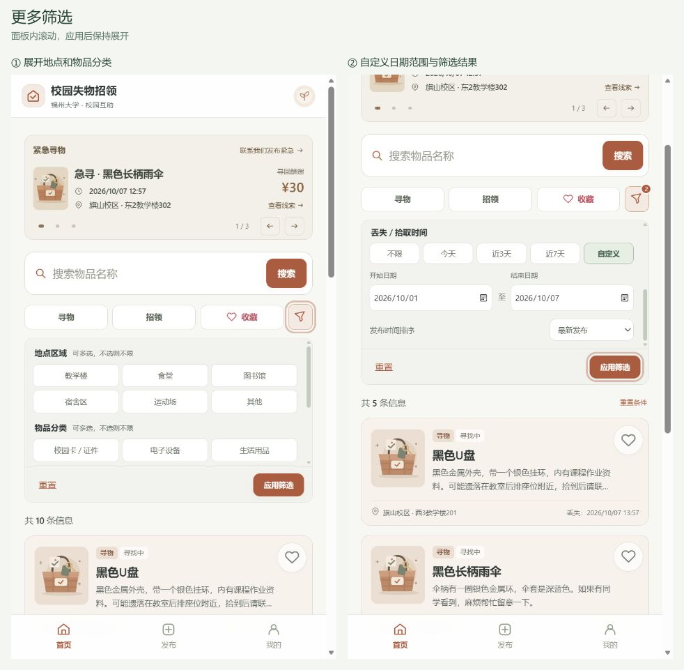

# 校园失物招领小程序：需求分析与原型设计

> 文档说明：前六节保留原型作业阶段的内容、截图与过程记录。第七节为2026年10月8日根据实际开发补充的修订，说明原型与网页实现之间的变化，不代表原墨刀稿已经同步更新。当前实现的是网页，尚未制作原生微信小程序。

| 项目                 | 内容                                                                                                                                         |
| -------------------- | -------------------------------------------------------------------------------------------------------------------------------------------- |
| 这个作业属于哪个课程 | [H202601软件工程与软件工程实践](https://edu.cnblogs.com/campus/fzu/2026-01SoftwareEngineeringandSoftwareEngineeringPractice)                 |
| 这个作业的要求在哪里 | [2026秋软件工程个人作业(第三次)](https://edu.cnblogs.com/campus/fzu/2026-01SoftwareEngineeringandSoftwareEngineeringPractice/homework/16742) |
| 这个作业的目标       | 完成「校园失物招领小程序」的需求分析和原型设计                                                                                               |
| 原型设计链接（墨刀） | [小程序链接](https://modao.cc/ai/share/6ab92e5975d0275ef6ff30c9?pvp=mobile)                                                                  |
| 结对成员             | 102402152（庄剑钇）、102402136（王智洋）                                                                                                     |

## 一、作业之前

本次作业要求结对完成需求分析与原型设计，不涉及程序实现。开始设计前，我们阅读了《构建之法》第 3 章和第 8 章的相关内容，并先讨论两人如何分工、用户要完成哪些操作，再决定原型需要哪些页面。考虑到后续结对编程还将依据本次原型开展，我们把功能简单、流程清楚作为设计依据。

## 二、需求分析

校园里的寻物和招领信息通常发在班级群、宿舍群或朋友圈。比如同学在教学楼捡到一张校园卡，消息可能只传到自己所在的群；失主不在群里，即使双方都发了消息，也很难发现彼此。群聊信息还会被新消息覆盖，事后查找不方便。小程序要解决的就是信息分散、难以搜索的问题，让同学们可以集中发布和查看信息。

主要用户是失主和拾得者。前者需要发布寻物信息或搜索招领信息，后者需要发布招领信息或查看是否有人在寻找；其他同学也可以浏览并转告相关信息。本版保留浏览、发布、搜索、查看详情和修改状态等基本功能。用户通过详情页提供的联系方式取得联系；实名认证、即时聊天、地图定位和复杂后台不在本次设计范围内。

## 三、主要功能与原型设计

我们使用**墨刀**制作可点击的手机端原型，在线地址见文首。底部设置“首页／发布／我的”三个入口，搜索页和详情页由首页进入。首页展示最近发布的寻物、招领信息，每张卡片显示物品名称、图片、地点、时间和状态；顶部搜索入口通向搜索页，用户输入关键词后查看结果，也可以按地点、时间、类型等条件筛选。

点击卡片进入详情页后，用户可查看物品描述、图片和联系方式，也可复制联系方式或收藏该条信息。例如看到“招领校园卡”，失主可以先核对拾取地点和时间，再联系发布者确认物品特征。招领照片不应露出完整卡号等个人信息。

发布页先选择“寻物”或“招领”，再填写物品名称、时间、地点、描述及联系方式，可上传图片。两种类型共用表单，时间和地点的提示文字分别对应“丢失”或“拾取”。必填项缺失时页面给出提示，提交成功后显示反馈。发布者还可以在“我的”查看和编辑信息，并在物品找回后修改状态。

## 四、用户使用流程

总体业务流程从首页开始。用户可浏览信息流，也可通过关键词和筛选条件查找物品；找到相关信息后进入详情页，核对时间、地点和物品特征，再复制联系方式与发布者沟通。若没有合适结果，可调整条件继续查找。物品确认归还后，发布者在“我的”中将状态改为“已找回”，完成信息闭环。

核心操作流程分为查看、发布和搜索三条路径。查看与搜索最终都进入详情页；发布时先选择寻物或招领类型，再填写相关信息。系统提交前检查必填项，缺失时提示补充，信息完整后发布成功。

## 五、结对过程与 PSP 记录

我们主要是在线下进行讨论交流的。首先我们阅读学习了《构建之法》。随后各自阅读题目（不受对方影响），各自现有一些思路后，再进行讨论。考虑实际应用场景下，应该具备哪些功能，具体应该是什么样的形式。除了这些基础功能外，我们还讨论到用户需要的便利操作或者操作反馈功能能。例如筛选收藏，一键收藏，一键复制，在发布/修改时给予反馈。讨论完成后，我们一人负责原型的设计，一人完成文档的撰写以及流程图的绘制。并每隔一段时间进行友好互动（互审），对其原型设计和文档的颗粒度。

下表记录各阶段的预估耗时和实际耗时，单位为分钟。

| 阶段               |    预估 |    实际 |
| ------------------ | ------: | ------: |
| 阅读教材           |      60 |      60 |
| 阅读题目与需求分析 |      40 |      60 |
| 草图与页面结构     |      40 |     100 |
| 原型初稿           |      90 |     120 |
| 原型修改           |      60 |     110 |
| 流程图             |      30 |      45 |
| 博客以及图片整理   |      60 |      80 |
| 结对检查           |      40 |      40 |
| **合计**           | **420** | **615** |

## 六、个人总结

### 个人总结

本次作业过程中，我主要负责讨论用户需求分析，功能梳理与确定，文档撰写以及流程图的绘制。队友主要负责原型的制作。

前期学习中，我开始对原型设计和开发之间的关系有一点理解：原型设计相当于为接下来的开发定下了可视化的稿子，把应用实现哪些具体功能，用户的交互逻辑定的更明白，也就是传统的原型设计更偏向于给用户需求，产品定位这一块，而和真正的代码开发关系不是那么大。也了解到一些新的开发方式其实也是将原型和UI开发结合，使得代码复用性更强一些。

在实践过程中，我了解了原型设计具体是做什么以及为何如此重要。口头的描述讨论，与形成的文档本就有差异了，文档和真正的软件界面设计，更具差别。而在原型设计的过程中，其可视化的表达力，让我们更能梳理好对于用户需要具备的功能，约束我们的实现。这种梳理可以是具体性的，例如我们说我们需要一个搜索功能，我们当时并不会考虑说它究竟应该放在哪个位置，是否应该具有历史搜索，是否应该让搜索后跳转到新的页面，但是这些东西在原型设计中就被确定下来，也就是对于用户对于搜索功能的需求对应的我们提供的搜索功能的操作流程，更加具体了；这种梳理也可以是优化性的，例如我们原本决定将收藏体现在个人页中，是在设计的过程中意识到，一件筛选收藏的功能放在主页会是一个更直观的选择，所以我们将收藏转移到了首页的筛查中；还能是开放添加新的等等等。总而言之，原型设计可以说是开发可视化设计必不可少的一环，由它定下了用户的最终交互逻辑。

作业中出现的一个比较明显的问题是我们前期讨论得太久，而没有尽快去进入实际原型设计的实践。这导致我们原本在讨论过程中产生的一些设计、美化理念，最终并没有成功落实到原型设计中，有些是讨论后再草稿上被遗忘，有些是缺少时间去完善。而且有一些东西，即使讨论清楚了在落地到设计的过程中才发现是不可行的，例如筛选中的一些东西并不好实现。所以软件设计不能长期停留在脑中的讨论阶段，需要尽早通过流程图、原型等可视化形式验证想法，再根据实际页面继续修改。特别是对于团队人数少的小项目，第一步应该是尽快把可视化的东西构建出来，而不是不断只在讨论中积累想法，在文档里添加内容，构建出基本的框架之后大家的思路才反而更能打开思路

## 七、开发阶段修订：原型与实际页面的对应

修订日期：2026年10月8日。本节对应当前仓库中的网页程序。原型主要用来确定页面、功能和操作流程；实际开发时，再把未说明清楚的规则补齐，并根据使用反馈调整界面。原型截图仍保留作为最初设计的记录，当前页面见[程序实现博客](2026-10-07-implementation-blog.md)。

### 7.1 保留的目标与调整的实现形式

解决的问题没有改变：把分散的寻物、招领信息放到同一个地方，让同学能查找、联系和管理发布。仍保留“首页／发布／我的”三个主要入口，核心流程仍是“发布信息→浏览或搜索→查看详情→在应用外联系→发布者更新完成状态”。

原型以小程序形式设计，当前交付改为手机和电脑浏览器可用的网页。前端使用HTML、CSS和JavaScript；直接打开`index.html`可以体验本地演示，启动本地服务后可以使用真实账号、数据库和图片上传。两种方式的数据分别保存，不会自动互相导入。网页和业务接口已经实现，原生小程序页面与微信登录尚未实现。

这个调整改变了运行方式，但保留了原来要完成的用户任务。后续若制作小程序，需要另外开发页面和身份接入，不能把现有网页直接称为小程序。

### 7.2 原型与实现对照

| 原型中的设计 | 当前实现 | 调整原因或范围 |
| --- | --- | --- |
| 首页浏览寻物、招领卡片 | 保留，卡片显示图片、名称、事件时间、地点与状态 | 仍以快速核对物品为目的，减少卡片中的次要文字 |
| 单独的搜索页面 | 搜索结果直接显示在首页，支持最近搜索 | 在同一页调整条件和查看结果，减少来回跳转 |
| 筛选底部面板 | 漏斗按钮展开可滚动的筛选区域 | 控制面板高度，避免把列表挤出屏幕；应用后保持展开，方便继续调整 |
| 地点、类型、时间筛选 | 外露寻物、招领、收藏；地点、分类、日期范围和排序放在展开区 | 保留常用入口，同时补齐多选和组合筛选规则 |
| 详情收藏、复制联系方式 | 保留，首页与详情可收藏，“我的”可查看收藏 | 收藏按账号保存；联系仍在应用外完成，不代表站内聊天 |
| 发布、编辑及图片 | 保留；本地服务模式支持上传图片，无图片时使用默认配图 | 静态演示不提供真实上传，避免混淆两种运行方式 |
| 发布者信息 | 显示发布者，并可打开其公开主页 | 补充昵称、头像、公开发布与数量统计；不公开账号和收藏 |
| 找回后修改状态 | 寻物显示“已找到”，招领显示“已归还”；允许确认后取消完成 | 统一命名，同时处理误操作 |
| “我的”统计与本人发布管理 | 保留统计、编辑、删除，增加收藏和已完成筛选 | 将本人管理与查看收藏分开，减少页面混杂 |
| 原有配色与信息层级 | 寻物、招领使用不同的柔和配色，完成信息另用灰蓝色 | 辅助区分类型和进度，仍保留文字状态，不只依赖颜色 |
| 原型阶段未详细设计的紧急信息入口 | 新增可滑动的急寻公告，突出图片、丢失时间、地点和酬谢 | 属于开发阶段新增功能；联系团队入口使用演示联系方式 |
| 原型阶段未详细设计的账号和存储 | 本地服务模式补充登录、SQLite、图片目录和个人设置 | 支持不同账号保存、管理自己的数据；尚未公网部署 |

#### 页面布局为什么与原型不同

原型确定了主要页面，但开发过程中对首页密度、公告高度、卡片长度、筛选大小和个人页分区进行了多次调整。这些调整来自本次开发中的讨论和试用反馈，不是原型阶段已经完成的UI方案，也没有经过正式用户实验。

| 页面或区域 | 当前布局与交互 | 对应的调整 |
| --- | --- | --- |
| 顶部与导航 | 顶部保留产品名称和校园信息；手机使用固定底部导航，电脑使用顶部导航 | 不再重复放置大段介绍，保持主要入口可见，修复发布页底栏被内容挤走的问题 |
| 首页内容顺序 | 紧急公告→搜索框→寻物／招领／收藏与漏斗→结果列表 | 把查找入口和信息列表集中起来，公告是后加区域；缩小高度以控制其占用 |
| 筛选展开区 | 选项采用统一尺寸，地点与分类多选，日期可选范围；内容滚动，操作区在外 | 原型中的底部面板改成页内展开，减少遮挡；应用后保留面板是后续明确选择的行为 |
| 列表卡片 | 首页保留较紧凑的摘要，把长描述放到详情；红心可直接操作 | 避免一条发布占据过长空间，收藏同时有选中颜色和点击反馈 |
| 类型与完成状态 | 寻物、招领用不同的柔和配色，已完成采用灰蓝色，同时显示文字 | 原型的统一视觉进一步细化为信息提示；完成后保留记录，不靠隐藏表示结束 |
| 发布与编辑 | 按字段组织信息、图片预览和时间选择；寻物地点为可能区域与最有可能地点 | 把模糊地点和不同时间含义表达清楚，而不是只替换表单颜色 |
| 我的与设置 | 个人资料、数量统计、我的发布与收藏分区；设置另页处理资料与浏览偏好 | 减少首页与个人页中的杂项，把账号资料和发布管理区分开 |
| 详情与公开主页 | 详情显示发布者，点击进入其公开资料与发布列表 | 原型已有发布者信息；可跳转主页和查看统计属于后续扩展 |
| 弹窗与操作反馈 | 删除、取消完成、清空收藏等操作确认；字段错误靠近字段，普通操作有简短反馈 | 明确动作结果，避免误操作；页面动效、红心反馈和缓存刷新都是后续细化 |

这里的点击反馈主要是按钮、颜色和动效变化，不代表所有浏览器和设备都支持实体振动。动效用于表达选中、展开或操作结果，不应妨碍阅读和操作。

#### 后加功能是否仍围绕原来的任务

新增内容分成三类，不都列为原型已有功能：

- **已有功能的细化：**收藏在原型中已经出现；首页快捷收藏、个人收藏列表、最近搜索、多选筛选、日期范围和取消完成，是把原来的查找与管理做得更具体。颜色提示也是对已有类型和状态的视觉细化。
- **新增的产品功能：**紧急公告、用户公开主页和资料设置在开发阶段补充。公告让急寻信息有单独入口；主页用于查看发布者的公开资料和发布情况；设置用于维护资料和查找偏好。这些是设计意图，尚不能宣称提高了找回率或证明了用户可信度。发布数只能提供参考，不能作为信誉认证。
- **运行所需的技术扩展：**账号、后端接口、数据库、图片存储和管理员公告维护，用来支持不同用户保存自己的数据。原型阶段没有详细设计这些技术内容；它们也不意味着已经接入学校或具备正式运营能力。

本次保留这些扩展，但展示时仍先说明发布、查找、联系和完成的核心流程。收藏、紧急公告和颜色提示作为三个主要特点；其他细节集中简要说明。后续若同步墨刀，需要按上述布局另出一版，并标注版本日期；当前仅更新文档及实机页面参考，原墨刀页面没有被重新绘制。

### 7.3 开发中补齐的业务规则

**时间分别记录。** 丢失时间和拾取时间是事件时间，由发布者填写，可填写具体时间或大致日期。发布时间和修改时间由系统记录。首页、公告和收藏卡片突出事件时间；详情和“我的发布”另外展示发布时间。日期范围筛选按事件日期判断，最新／最早排序按发布时间判断，不能把这两类时间当作同一字段。发布和编辑不再提供“时间不详”选项；历史未知时间记录保留兼容，编辑时需要补充日期。

**丢失地点可以不确定。** 寻物允许选择多个可能丢失的区域，展示时标明“模糊范围”，补充文字使用“最有可能的地点”。招领仍选择一个拾取区域。多个区域中的任意一个符合所选地点即可匹配，避免把失主不确定的范围写成一个确定位置。

**多选筛选有明确规则。** 同一组内按“任意一个符合”处理，例如选择图书馆和教学楼，两个区域的记录都可出现；不同组之间需要同时满足，例如地点符合且分类符合。未选择的组不限制结果，日期范围包含起止日期。展开后先修改待应用条件，点击应用才影响列表；重置先清空待应用条件，未应用就关闭会放弃这次改动。应用后面板保持展开。

**完成状态不等于联系成功。** 点击复制联系方式、打开发布者主页或收藏，都不会改变完成状态。只有发布者在确认找回或归还后才能修改。寻物与招领内部共用进行中／已完成两种进度，页面根据类型显示对应文字。取消完成需要确认，并保留原内容和发布时间。“我的发布”中的已完成条件可以与寻物／招领条件组合。

**公开信息与个人信息分开。** 用户可以修改昵称、头像、简介、校区和常用联系方式。公开主页显示公开资料及发布统计，不展示私人收藏和登录账号。常用联系方式只用于本人设置和新发布的默认填写；帖子联系方式在本地服务模式中登录后可见。后端根据登录会话确定发布者，不接受用户自行指定别人作为发布者。

### 7.4 当前页面与数据怎样连接

| 部分 | 实际职责 |
| --- | --- |
| `js/views.js` | 根据数据生成首页、详情、表单、个人主页与设置页面 |
| `js/app.js` | 处理页面跳转、按钮操作、表单提交和数据刷新 |
| `js/data.js` | 校验字段，处理搜索、组合筛选和状态等规则 |
| `js/api.js` | 在本地服务模式中向后端请求数据并接收结果 |
| `server/app.cjs` | 验证会话与权限，处理业务接口，读写SQLite |
| SQLite与图片目录 | 分别保存结构化记录和上传文件 |

例如在本地服务模式中发布一条寻物信息：页面收集字段→检查输入→有新图片时先上传→发送发布请求→后端确定发布者并再次检查字段→写入数据库→前端收到成功结果后更新显示。保存失败就提示失败并保留输入，不提前显示发布成功。修改状态后重新获取数据，各页面根据更新后的记录展示。

首页和“我的”再次切换时先显示已取得的数据，再请求更新，减少加载提示闪动。第一次读取尚无数据的页面仍需要加载反馈。这属于开发时补充的交互细节，不改变原型中的业务流程。

### 7.5 当前界面参考与尚未实现的范围

下面展示的是开发后的页面，用来说明修订结果，不是重新绘制的墨刀原型。

原设计中排除的学校实名认证、即时聊天和地图定位仍未实现。详情中的联系方式用于应用外沟通；没有通用的社交分享接入。紧急公告可以展示和由管理员维护，但“联系我们发布紧急”目前展示团队演示微信，网页没有接通真实运营联系或急寻申请表单。预置发布与公告用于演示，不能当作真实校园信息。

当前是可以本地运行的网页项目，不是已经上线运营的校园服务。账号、数据库和上传属于开发阶段扩展，原生微信小程序、微信身份接入和公网部署不在本次交付中。具体启动与接口说明见[本地完整应用文档](local-backend.md)。

### 7.6 与原型对齐的检查方式

检查时按用户任务逐项操作：能否发布→能否在首页查到→能否打开详情并获得联系方式→能否由本人编辑和完成→刷新后数据是否仍在。再检查非本人不能修改、无结果时能调整条件、保存失败不误报成功，以及收藏和多选筛选是否按上述规则工作。

原型是最初设计，本节是开发后的修订记录。程序实现博客应引用这里的差异及原因，不把新功能写成原型阶段已经完成的内容。原型作业的分工、PSP和个人总结也不替换为开发阶段记录；本次开发过程需另按实际情况填写。
