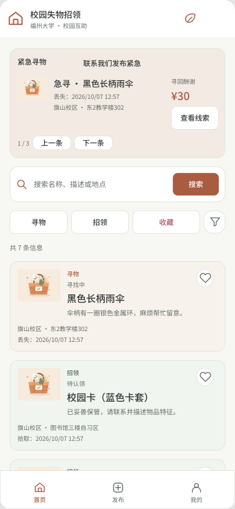
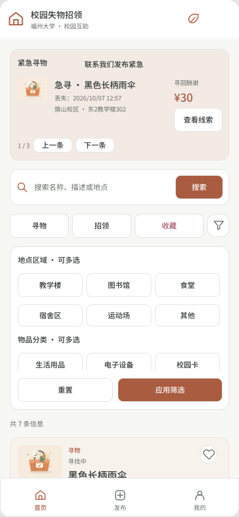
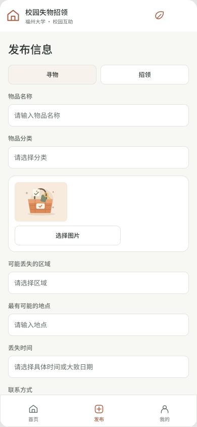
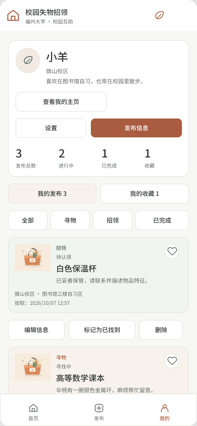
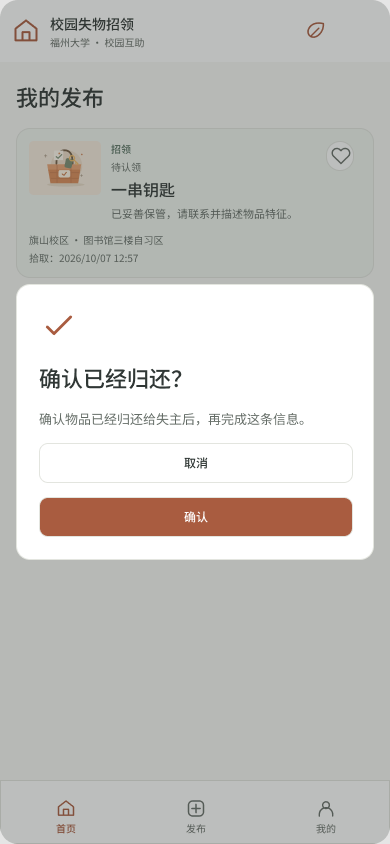
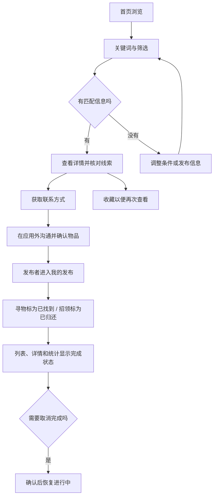
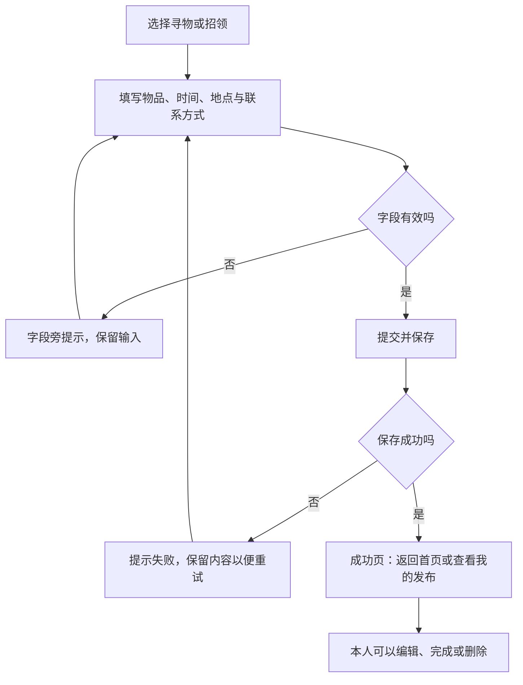

# 校园失物招领：需求分析与原型设计

| 项目 | 内容 |
| --- | --- |
| 这个作业属于哪个课程 | [H202601软件工程与软件工程实践](https://edu.cnblogs.com/campus/fzu/2026-01SoftwareEngineeringandSoftwareEngineeringPractice) |
| 这个作业的要求在哪里 | [2026秋软件工程个人作业（第三次）](https://edu.cnblogs.com/campus/fzu/2026-01SoftwareEngineeringandSoftwareEngineeringPractice/homework/16742) |
| 这个作业的目标 | 分析校园失物招领的需求，设计页面、操作流程和业务规则 |
| 结对成员 | 王智洋（102402136）、庄剑钇（102402152） |
| Figma设计文件 | [校园失物招领](https://www.figma.com/design/xwC2YwDURRDcY7ZBZLgFMi?node-id=1-183) |
| 原型点击预览 | [进入原型](https://www.figma.com/proto/xwC2YwDURRDcY7ZBZLgFMi?node-id=1-183&starting-point-node-id=1%3A183&scaling=scale-down) |
| 项目仓库 | [102402136-102402152](https://github.com/MieSheeeep/102402136-102402152) |

## 一、需求分析

校园里的寻物和招领信息经常发在班级群、宿舍群或朋友圈。比如有人在教学楼捡到校园卡，消息可能只发在自己所在的群里，失主却不在这个群。双方都在找人，但不一定能看到彼此的信息。群聊消息还容易被覆盖，过一段时间再找也不方便。

我们希望提供一个集中发布和查找信息的地方。失主可以发布寻物信息，也可以查看别人捡到的物品；拾得者可以发布招领信息，等待失主联系。确认找回或归还后，由发布者更新状态，减少其他同学重复询问。

| 用户 | 想完成什么 | 对应功能 |
| --- | --- | --- |
| 失主 | 查找自己的物品，留下寻物线索 | 浏览招领、搜索筛选、发布寻物、收藏、查看联系方式 |
| 拾得者 | 找到失主，说明在哪里捡到物品 | 发布招领、核对物品特征、提供联系方式、标记已归还 |
| 其他同学 | 浏览信息，帮忙留意或转告 | 查看详情、收藏、查看急寻公告 |
| 发布者 | 管理自己填写的信息 | 编辑、删除、完成与取消完成、查看本人发布 |
| 管理员 | 维护急寻公告和处理不合适的内容 | 设置和撤下公告、删除违规内容 |

失主和拾得者是使用场景中的角色，不需要两套账号。一个同学既可能丢东西，也可能捡到东西。

## 二、功能范围与设计重点

核心功能是发布、浏览、搜索、查看详情和管理本人信息。用户在详情页取得联系方式，再到应用外沟通。收藏、紧急公告和颜色提示作为三个主要特点：收藏便于再次查看线索，公告为急寻信息提供集中入口，颜色帮助区分寻物、招领和完成状态。

账号和个人资料用于识别发布者、保存个人收藏与偏好。公开主页展示发布情况，方便查看相关信息，但发布数量不能当作信誉认证。学校实名认证、站内聊天和地图定位不包含在这套设计中。

原型以手机页面为主，保留“首页／发布／我的”三个主要入口，也考虑电脑浏览器的使用。页面形式不等于微信能力：当前项目使用网页和后端接口，没有接入原生微信小程序或微信登录。

## 三、页面结构与原型设计

Figma原型包含42个页面和状态，画板为390×844。文字、图标、按钮和卡片均为可编辑图层，重复内容使用组件。首页、发布和个人中心分别设置了预览起点。表单填写、保存和账号操作通过预设状态展示交互，不在Figma中执行真实数据写入。

### 3.1 首页

首页从上到下依次为顶部栏、紧急公告、搜索框、快捷筛选和信息列表。顶部保留项目名称和校园信息，正文直接进入查找操作，不重复放置大段介绍。手机底部导航保持可见，避免进入发布页或滚动后找不到入口。

卡片展示物品图片、名称、简短描述、地点、丢失／拾取时间和状态。长描述留在详情页，首页只保留便于判断的内容。点击卡片进入详情，点击红心收藏；两种操作分开，避免想收藏时误打开详情。

### 3.2 搜索与筛选

搜索结果留在首页，可以继续调整关键词和筛选，不需要在几个页面之间来回跳转。关键词匹配名称、描述和地点，忽略首尾空格与字母大小写；输入多个关键词时，每个词都需要匹配。点击搜索框可以查看最近搜索，设置中可关闭记录或清空历史。

首页直接显示寻物、招领和收藏，其他条件通过漏斗图标展开。地点和物品分类允许多选，时间支持今天、近3天、近7天和自定义日期范围，还可以按发布时间排序。

同一组内满足任意选项即可，例如选择教学楼和图书馆，两处的信息都能出现；不同组需要同时满足，例如地点符合且分类符合。没有选择的组不限制结果。日期范围包含开始和结束日期。

展开后先修改待应用条件，点击“应用筛选”才更新结果。应用后保持展开，方便继续调整；未应用就关闭时，放弃这次修改。重置先清空待应用条件。面板内容可滚动，底部的重置和应用按钮单独保留，避免筛选区占用太多空间。

### 3.3 发布与编辑

寻物和招领共用表单，填写名称、分类、地点、时间、描述和联系方式，可以添加图片。切换类型后，地点和时间的提示分别对应丢失或拾取。没有图片时使用默认配图，不影响提供文字线索。

失主可能记不清在哪里丢了东西，因此寻物允许多选可能区域，并用“模糊范围”说明不确定性；补充位置使用“最有可能的地点”。招领填写一个拾取区域和拾取地点，不把确定的拾取位置写成多个猜测。

丢失／拾取时间由用户填写，支持具体时间或大致日期；发布时间和修改时间由系统记录。列表突出事件时间，详情和我的发布另外展示发布时间。日期筛选依据事件时间，最新／最早排序依据发布时间。

必填内容为空、只有空格或日期无效时，在对应字段旁提示，并保留已经填写的内容。保存成功后提供返回首页和查看我的发布两个入口。编辑页回填原信息，保存后保留原发布时间。

### 3.4 详情与发布者主页

详情展示图片、完整描述、分类、地点、事件时间、发布者和发布时间。失主先核对物品特征，再取得或复制联系方式，与发布者沟通。获取联系方式不会自动将信息标为完成。

点击发布者可查看公开主页，包括昵称、头像、简介、校区、发布数量、进行中和已完成数量，以及其公开发布列表。登录账号、私人收藏和个人设置中的常用联系方式不放在公开主页中。

图片和描述应避免暴露完整校园卡号等个人信息。帖子联系方式在网页的后端模式中登录后可见，公开资料与私人资料分开。

### 3.5 我的

个人页上方展示昵称、头像、校区、简介和数量统计，下方分为我的发布和我的收藏。我的发布提供寻物、招领和已完成筛选，并能编辑、修改状态和删除。收藏区用于再次查看线索，不提供管理别人信息的按钮。

完成信息仍保留在列表中，并显示完成状态。误点完成后可以取消，恢复为寻找中或待认领。删除、取消完成和清空收藏等操作需要确认，确认文字说明会发生什么。

### 3.6 设置与账号

设置集中处理昵称、头像、简介、校区、常用联系方式、默认排序和搜索记录，不把这些选项全部塞进个人页。校区通过选择填写，避免同一个校区出现不同写法。常用联系方式作为新发布的默认值，发布时仍可以修改。

账号页面包括登录、注册、修改密码和恢复码找回。注册成功后展示恢复码，用户自行保存；找回账号时凭恢复码重设密码。普通用户只能管理本人发布与收藏，管理员入口用于公告和内容维护。

## 四、三个主要特点

### 4.1 收藏

看到可能有关的线索时，用户可以先收藏，再到个人页查看。首页也提供只看收藏的入口，可以结合类型和其他条件继续查找。红心使用独立颜色、选中状态和点击反馈，让用户知道是否已经收藏。取消收藏只影响本人收藏，不删除公共发布。

### 4.2 紧急公告栏

公告突出物品名称、图片、丢失时间、地点和酬谢金额，不在首页塞入完整描述。多条公告可以左右切换，也有上一条和下一条按钮；点击查看线索进入对应详情。公告不自动播放，让用户有时间读完。

“联系我们发布紧急”展示团队联系方式和需要提供的信息，普通发布仍通过发布页完成。管理员负责维护公告，已完成的寻物不应继续占用急寻位置。当前联系入口使用演示微信，不代表已经接通真实运营团队或在线申请服务。

### 4.3 颜色提示

寻物卡片使用柔和的暖色，招领使用柔和的绿色，完成信息使用灰蓝色。颜色辅助判断，卡片仍保留“寻物／招领”和“寻找中／待认领／已找到／已归还”等文字。收藏红心使用单独颜色，避免与完成状态混淆。

其他交互包括最近搜索、日期范围、模糊地点说明、图片预览、字段错误提示和确认弹窗。按钮、筛选展开和收藏使用简短动效表达反馈，页面保持统一的字体、间距和圆角；再次切换首页与个人页时先展示已有内容，再获取更新，减少加载提示闪动。

## 五、用户流程与业务规则

### 5.1 查找、联系与完成

### 5.2 发布与编辑

| 规则 | 说明 |
| --- | --- |
| 信息类型 | 寻物和招领共用信息结构，时间、地点和状态文案按类型区分 |
| 完成状态 | 寻物为寻找中／已找到，招领为待认领／已归还；只有发布者可修改 |
| 时间 | 日期筛选依据丢失／拾取时间，最新／最早排序依据发布时间 |
| 模糊地点 | 寻物可有多个可能区域，招领只有一个拾取区域；匹配任一可能区域即可 |
| 收藏 | 属于个人数据，不修改公共发布；完成的物品也可以保留收藏 |
| 编辑 | 保留信息编号、发布者和原发布时间，更新内容与修改时间 |
| 删除 | 先确认，再移除发布和相关收藏；不能删除他人发布 |
| 操作结果 | 保存成功后才提示成功；失败时保留输入，不把点击提交当作保存完成 |

## 六、信息怎样组织

首页卡片、详情和我的发布使用同一条物品记录，不能各自保存一份互不关联的内容。记录包含编号、发布者、类型、名称、分类、地点、事件时间、联系方式、描述、图片、完成状态、发布时间和修改时间。

| 数据 | 用来做什么 |
| --- | --- |
| 用户与会话 | 识别当前用户，确定发布归属和操作权限 |
| 物品发布 | 生成首页、详情、本人发布和公开发布列表 |
| 收藏关系 | 记录哪个用户收藏了哪条发布 |
| 个人偏好 | 保存默认排序、搜索记录及记录开关 |
| 公告 | 关联寻物信息，保存酬谢金额和有效期 |
| 图片 | 保存物品照片和头像，记录所属用户 |

网页通过后端接口读写数据库和图片文件。直接打开HTML的演示方式使用浏览器本地存储，两种方式分别保存数据。Figma原型用于查看页面和操作关系；实际存储、权限检查和多账号行为由程序完成。

## 七、原型检查

检查以用户能否完成任务为依据，既看正常流程，也看没有结果、输入错误和误操作。

| 场景 | 应看到的结果 |
| --- | --- |
| 发布完整的寻物或招领信息 | 成功页提供后续入口，列表和本人发布能找到该信息 |
| 必填项为空或只有空格 | 字段旁提示错误，其他输入保留 |
| 组合地点、分类和时间条件 | 结果按组内任选、组间同时满足的规则匹配 |
| 搜索没有结果 | 显示无结果提示，允许调整或清除条件 |
| 收藏与取消收藏 | 红心状态、首页收藏筛选和个人收藏列表一致 |
| 完成与取消完成 | 类型对应的状态文字、配色和统计同步变化 |
| 操作别人的发布 | 不提供本人管理按钮，程序也检查权限 |
| 删除或清空收藏 | 先确认，取消不改变原内容 |
| 切换或滚动手机页面 | 底部入口可见，主要操作不被遮挡 |
| 查看不同的急寻公告 | 进入该公告对应的物品详情 |

原型已检查跳转目标有效，并查看首页、筛选、发布、个人页和弹窗的布局。Figma中的预设状态不能代替程序测试；数据保存、接口权限和浏览器行为需要在可运行项目中另外验证。

## 八、结对分工与PSP记录

两人的分工记录为：王智洋负责需求讨论、功能梳理、文档和流程图，庄剑钇负责原型制作，双方共同讨论和检查页面。原型与文档整理使用AI辅助，成员职责和耗时仍以实际记录为准。

下表保留需求与原型工作的PSP记录，不包含程序开发耗时。单位为分钟。

| 阶段 | 预估 | 实际 |
| --- | ---: | ---: |
| 阅读教材 | 60 | 60 |
| 阅读题目与需求分析 | 40 | 60 |
| 草图与页面结构 | 40 | 100 |
| 原型初稿 | 90 | 120 |
| 原型修改 | 60 | 110 |
| 流程图 | 30 | 45 |
| 博客以及图片整理 | 60 | 80 |
| 结对检查 | 40 | 40 |
| **合计** | **420** | **615** |

实际耗时比预估多195分钟，其中草图、页面结构和原型修改的差距较大。讨论功能时容易觉得一个想法已经清楚，放到页面上才会发现入口、字段和布局还没确定。需要尽早把基本页面画出来，再围绕具体页面讨论，避免想法不断增加却没有落实。

## 九、个人总结

我的主要工作是需求分析、功能梳理、文档和流程图。口头讨论和实际页面存在差别：只说需要搜索，还没有确定搜索的位置、历史记录和结果展示方式；只说需要收藏，也没有明确首页筛选与个人页入口的关系。原型把这些问题具体地呈现出来，便于双方检查和讨论。

原型工作中的一个问题是前期讨论太久，没有尽快把基本页面做出来。一些想法没有落实，也有一些内容放到页面上才发现不合适。后续应该先完成核心流程和基本页面，再根据具体页面继续修改，而不是不断在讨论中增加想法。文档、原型和程序也要保持一致，特别是状态名称、时间含义和权限规则，不能各写一套。
